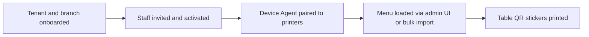
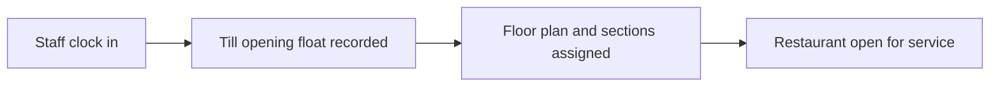
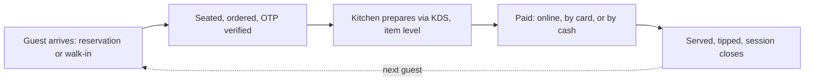
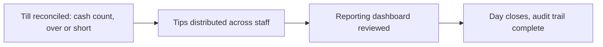

# The Restaurant's Operating Day, Start to Close

**Status:** Draft for lead review
**Scope:** Setup · Daily open · Service loop · Daily close

Four phases — one-time setup, daily open, the guest-journey loop that repeats all day, and daily close — the complete operating picture, end to end.

A single guest's order is only the middle of the day. This lays out the whole thing: how the restaurant opens, how one guest moves from arrival to a closed tab, how the day closes out, and what runs quietly in the background the entire time.

---

## The Four Phases

Setup once. Open and close daily. Loop in between.

### 1 — Setup (once per tenant/branch)

**Getting a restaurant onto the platform.** Everything here happens once when a branch is onboarded, and again only when something changes — new staff, a new printer, a menu overhaul.

### 2 — Daily open (start of every service day)

**Opening the doors.** Runs once per day, before the first guest is seated.

### 3 — Service loop (repeats for every guest, all day)

**One guest's journey, start to close.** This is the core of the business — it happens continuously, for every table, all service long.

*Loops for the next guest — runs continuously through service.*

### 4 — Daily close (end of every service day)

**Closing the doors.** Runs once per day, after the last table has closed out.

---

## Running underneath all four phases, not a step in any of them

- **Every sensitive action is audited** and browsable in the audit log viewer — price changes, refunds, role changes, cancellations.
- **Payment reconciliation console** surfaces any payment that didn't settle cleanly, independent of which phase it happened in.
- **Suspicious-order flagging** lets a cashier flag an order against a visibly empty table at any point during service.
- **Device health monitoring** watches printer/KDS connectivity continuously, not just when something is actively printing.
- **Full-outage offline mode** is the fallback for phases 2–4 if the branch loses internet entirely — local session validity, local order queue, sync on reconnect.

---

## What needs a decision, not just a look

Five questions this raises but doesn't answer on its own.

**1. Do we support cash at the counter, or card/EMV only?**
Phase 3 assumes all three payment paths are live. Supporting cash makes till reconciliation in Phase 4 mandatory, not optional — worth deciding before it's built either way.

**2. Are reservations in scope for launch, or is it walk-in + QR only?**
A booking system and a walk-in waitlist are genuinely different builds. This changes what Phase 3 looks like on day one.

**3. How are tips pooled and distributed?**
Even split, role-weighted, or left entirely to each location's own house policy? This feeds directly into Phase 4's payroll handoff.

**4. What's acceptable during a full internet outage?**
The assumed fallback is a local order queue that syncs on reconnect. Worth confirming that's the actual bar we want to hold, not just the default answer.

**5. Who can flag a suspicious order, and what happens after?**
The flag itself is in the flow — the review/escalation process after a flag is raised isn't defined yet.

---

*Diagram labels compress a few branch points into short phrases (e.g. "online, by card, or by cash") to keep each phase readable as a single flow rather than a full decision tree.*
