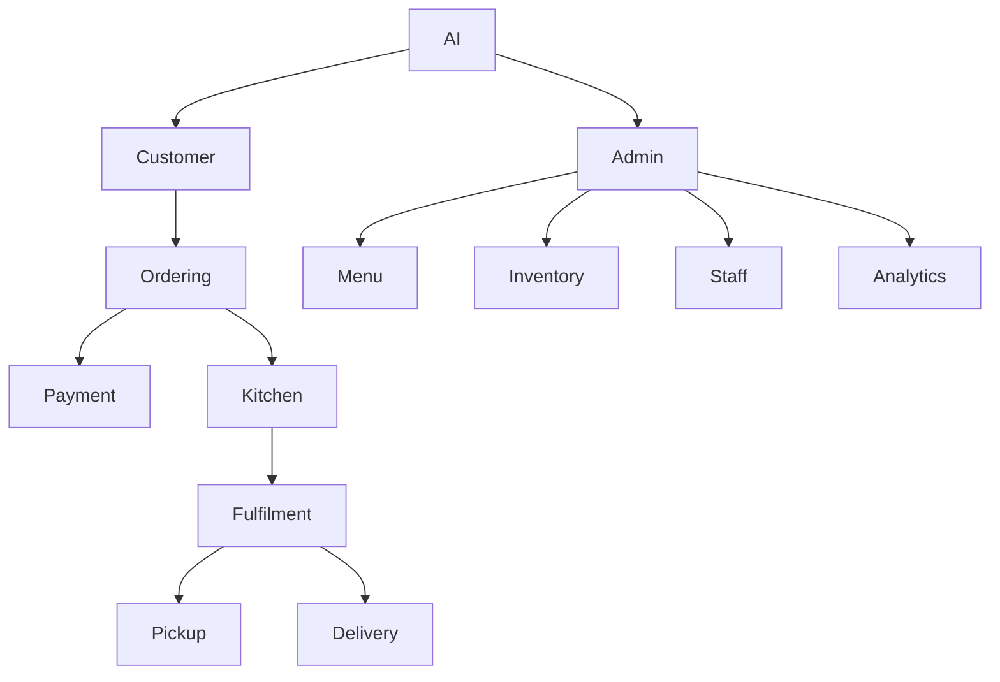

# Product Requirements Overview

Requirements are organised by module and classified as **MVP**, **Growth**, **Advanced**, or **Enterprise**.

## Functional domains

1. Customer identity and profile
2. Restaurant and branch administration
3. Menu, modifiers, bundles and pricing
4. Dine-in, pickup, delivery and scheduled orders
5. Kitchen orchestration and production routing
6. Payments, refunds and reconciliation
7. Inventory, recipes, suppliers and purchasing
8. Loyalty, CRM, campaigns and feedback
9. Delivery operations
10. Analytics and AI
11. Devices and third-party integrations
12. Platform administration
