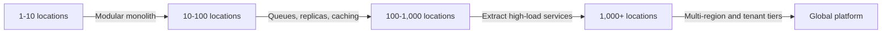

# Multi-Tenancy and Scaling

## Tenancy options

| Model | Advantages | Constraints | Suggested use |
|---|---|---|---|
| Shared tables with tenant ID | Efficient and simple | Requires strict query enforcement | MVP and SMB tenants |
| Schema per tenant | Better logical separation | Migration complexity | Mid-market tenants |
| Database per tenant | Strong isolation | Higher cost and operations | Enterprise chains |

## Scaling path

Critical boundaries likely to be extracted first: notifications, integration adapters, reporting, AI processing and delivery tracking.
