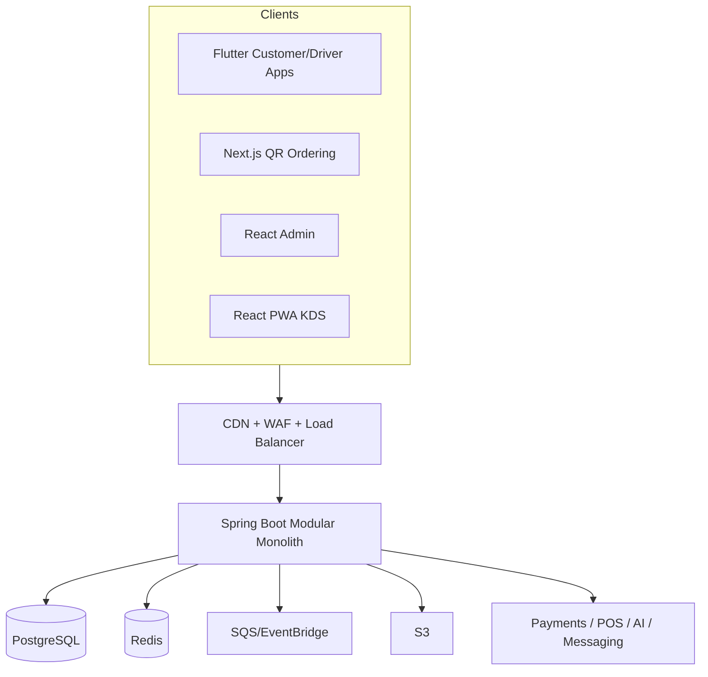

# Architecture Overview

## Recommended starting architecture

A modular monolith provides fast delivery and clear domain boundaries while avoiding premature distributed-system complexity.

## Technology options

| Layer | Preferred | Alternatives | Decision trigger |
|---|---|---|---|
| Customer mobile | Flutter | React Native, native | Team capability and device SDK support |
| Admin web | React | Vue, Angular | Existing expertise and hiring |
| QR web | Next.js | Nuxt, React SPA | SEO and fast first load |
| Backend | Spring Boot | NestJS, ASP.NET Core | Domain complexity and engineering skill |
| Database | PostgreSQL | MySQL, Aurora | Relational integrity and tenant controls |
| Queue | SQS | RabbitMQ, Kafka | Throughput and event replay needs |
| Runtime | ECS Fargate | Kubernetes, serverless | Operational maturity and scale |
