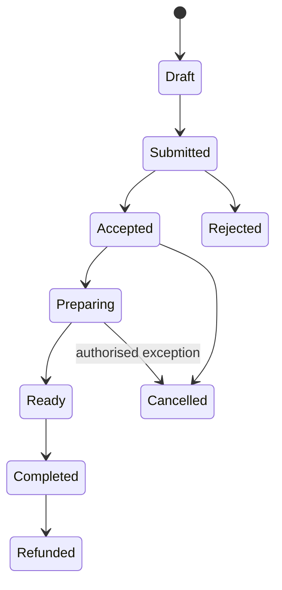

# API and Event Strategy

## Options
- REST for public and transactional APIs
- WebSocket or server-sent events for live order/KDS updates
- Webhooks for payment and partner callbacks
- Events for reliable internal workflows
- GraphQL only where client aggregation provides a measurable benefit

## Order lifecycle

All mutating APIs require idempotency keys where retries may occur.
