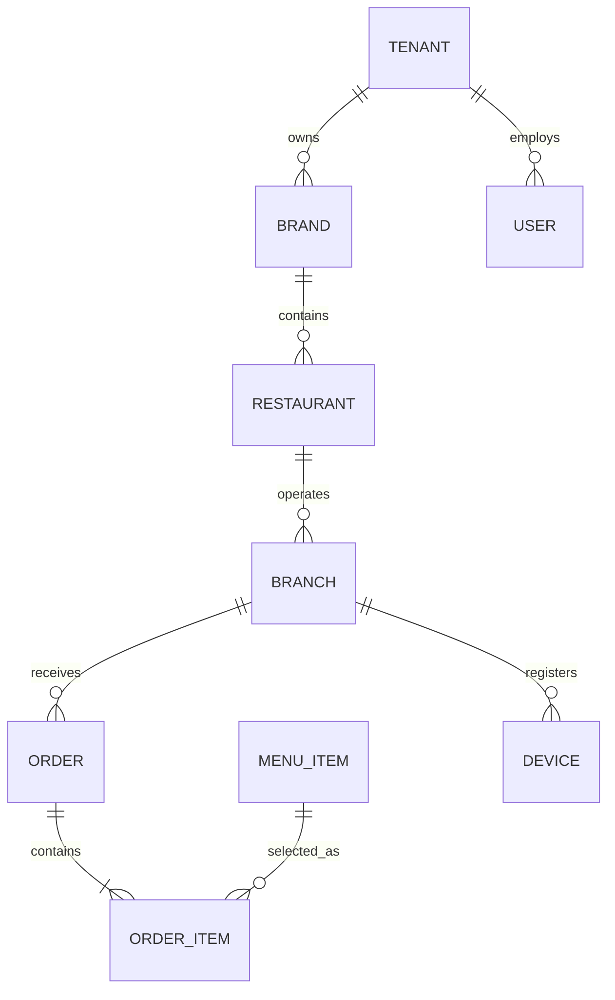

# Data Model Strategy

## Core hierarchy

## Data principles
- Every tenant-scoped entity carries an immutable tenant identifier.
- Money uses decimal types and explicit currency codes.
- Order financial snapshots are immutable after settlement.
- Personally identifiable data is minimised and encrypted where necessary.
- Audit events are append-only.
