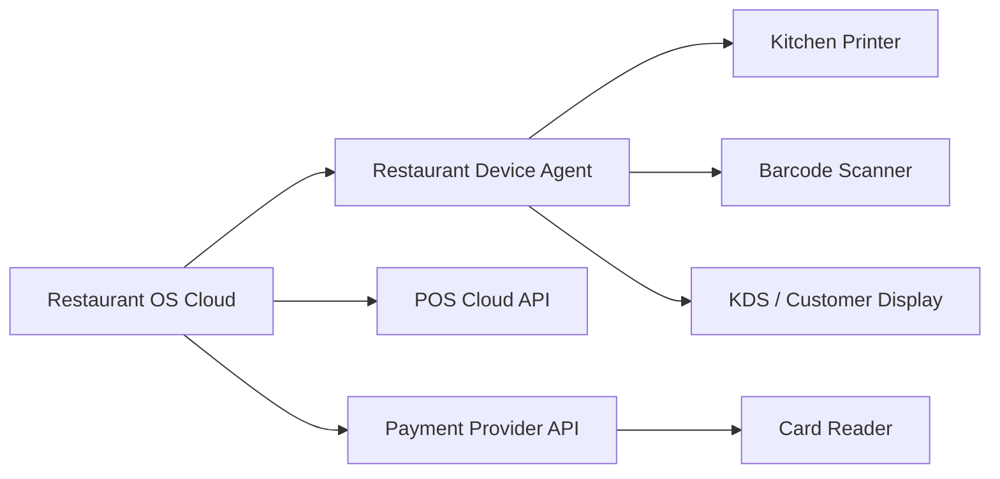

# Device Integration Strategy

## Integration patterns

| Device or platform | Integration options | Recommended sequence |
|---|---|---|
| POS | Square, Toast, Clover, Lightspeed | Build adapter framework, then prioritise by pilot demand |
| Payment terminal | Stripe Terminal, Square Terminal | Choose one provider for MVP |
| Kitchen printer | Epson ePOS, Star CloudPRNT/local SDK | Add after stable KDS |
| KDS | Browser PWA, Android tablet, iPad | Browser PWA first |
| Barcode scanner | Keyboard emulation, Bluetooth, native SDK | Keyboard emulation first |
| Customer display | Web display or casting | Growth phase |
| Cash drawer | Printer-triggered or POS-managed | POS-managed where possible |

## Reliability rules
- Persist the order before sending any device command.
- Use idempotent print and payment requests.
- Track device heartbeat, firmware, capabilities and branch assignment.
- Queue commands during temporary outages and expose operator recovery actions.
