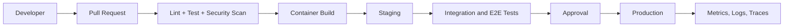

# DevOps and Deployment

## Environment options
- Local: Docker Compose
- CI: GitHub Actions
- Runtime: ECS Fargate initially
- Infrastructure as code: Terraform or AWS CDK
- Observability: CloudWatch plus OpenTelemetry; optional Sentry for client errors
- Deployment: blue/green or rolling with automatic rollback

Production configuration, secrets and tenant data must never be stored in the Git repository.
