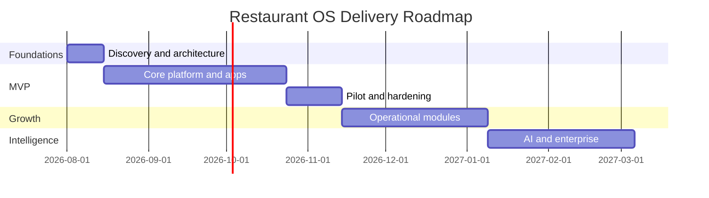

# Delivery Roadmap

## Phase 0 — Discovery and foundations
- Pilot restaurant interviews
- User journeys and service blueprint
- Architecture decisions and threat model
- Design system and domain model

## Phase 1 — MVP
- Multi-tenant onboarding
- Menu and branch administration
- QR/dine-in and pickup ordering
- Stripe or Square payment
- KDS
- Notifications
- Basic reporting

## Phase 2 — Operational depth
- Inventory and recipe engine
- Loyalty and CRM
- Reservations
- Printer integration
- First POS adapter
- Driver delivery app

## Phase 3 — Intelligence and enterprise
- Forecasting and operational copilot
- Voice ordering
- Franchise management
- Central kitchen
- Advanced analytics and dedicated tenancy

