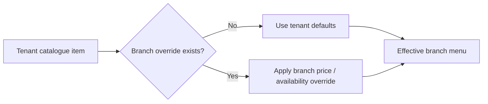
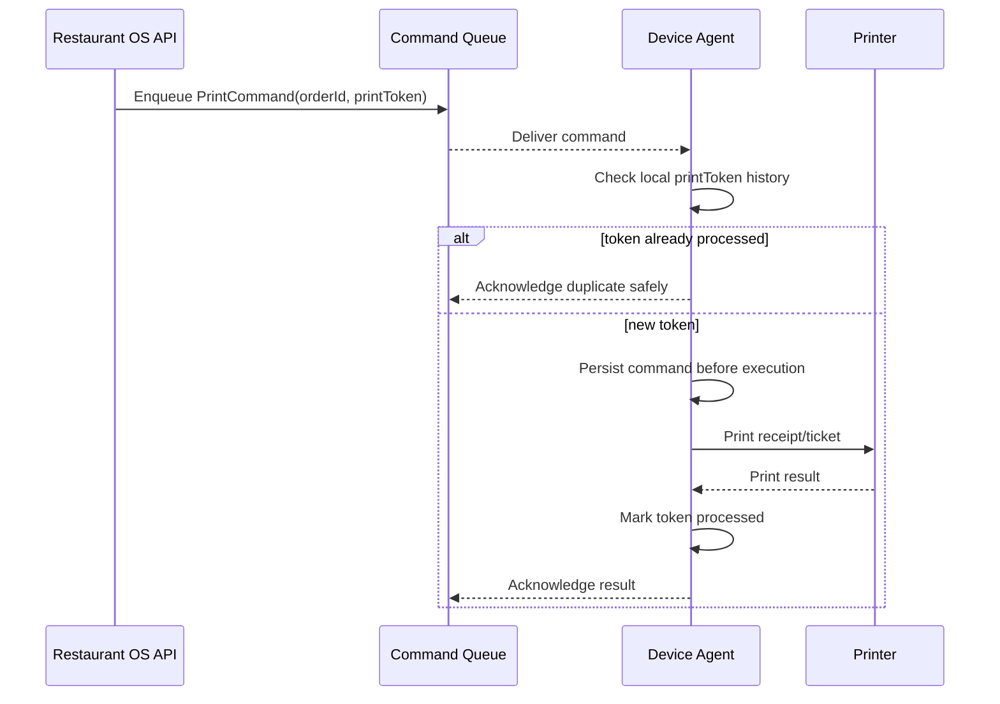
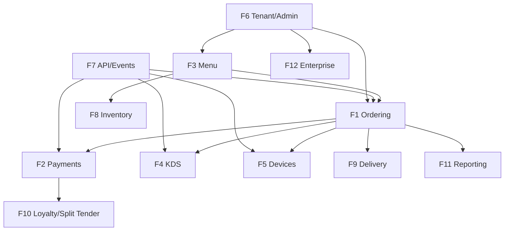

# Restaurant OS — Feature Catalogue

**Document ID:** ROS-FEAT-001  
**Status:** Canonical  
**Priority legend:** P1 = MVP, P2 = Growth, P3 = Enterprise/Future

---

## 1. Feature portfolio

| ID | Feature | Priority | MVP status |
|---|---|---:|---|
| F1 | Customer Ordering | P1 | Required |
| F2 | Checkout, Payments & Refunds | P1 | Required |
| F3 | Menu & Catalogue Management | P1 | Required |
| F4 | Kitchen Operations / KDS | P1 | Required |
| F5 | Device Integration & Printing | P1 | Required |
| F6 | Tenant, Branch, Staff & Admin | P1 | Required |
| F7 | Platform API, Events & Reliability Controls | P1 | Required |
| F8 | Inventory & Recipe Management | P2 | Deferred |
| F9 | Delivery & Driver Management | P2 | Deferred |
| F10 | Loyalty, Promotions & Split Tender | P2 | Deferred |
| F11 | Reporting & Analytics | P2 | Deferred beyond baseline operational telemetry |
| F12 | Enterprise Multi-Tenant Capabilities | P3 | Deferred |
| F13 | AI Assistance & Automation | P3 / gated | Requires ADR before activation |

---

## 2. F1 — Customer Ordering

**Priority:** P1  
**Primary users:** Customer, Cashier  
**Dependencies:** F3, F6, F7

### Definition

Guest-first mobile-web ordering for dine-in and supported counter/pickup flows. The feature includes QR context resolution, effective menu browsing, cart management, modifiers, dietary/allergen display, special instructions, OTP verification when required, order submission and customer-visible order status.

### MVP capabilities

- QR deep link for tenant/branch/table
- Public effective menu
- Search/filter-ready menu structure
- Item detail
- Modifier selection
- Required/optional modifier validation
- Quantity changes
- Special instructions
- Cart summary
- Tax/service-charge/tip presentation where configured
- OTP verification at checkout
- Online/pay-at-counter choice according to branch policy
- Order confirmation
- Order-status view

### Exclusions

- Customer loyalty wallet
- Stored card vault controlled by Restaurant OS
- Cross-restaurant cart
- Complex scheduled ordering
- Group payment/split tender

### Acceptance outcomes

- menu loads within defined performance target;
- invalid modifier combinations cannot be checked out;
- server recalculates totals;
- retry cannot create duplicate confirmed orders;
- confirmed order reaches KDS target latency.

---

## 3. F2 — Checkout, Payments & Refunds

**Priority:** P1  
**Primary users:** Customer, Cashier, Manager  
**Dependencies:** F1, F6, F7

### Definition

Secure collection and reconciliation of payment without Restaurant OS handling raw PAN data.

### MVP capabilities

- Branch payment mode: `pay_online`, `pay_at_counter`, `both`
- Server-created PaymentIntent/reference
- Provider-hosted/tokenized card element
- Idempotent payment creation
- Signature-verified webhook
- Webhook deduplication
- Payment state reconciliation
- Manager-authorized full/partial refund
- Refund reason capture
- Audit entry

### Core rules

- raw PAN never enters Restaurant OS API;
- external payment success is not trusted solely from client response;
- webhook/provider reconciliation is authoritative for settlement state;
- refund amount cannot exceed remaining refundable amount;
- duplicate webhook processing must be harmless.

---

## 4. F3 — Menu & Catalogue Management

**Priority:** P1  
**Primary users:** Owner, Manager  
**Dependencies:** F6, F7

### Definition

Tenant-level catalogue with branch-level overrides and restaurant-ready item configuration.

### MVP capabilities

- Categories
- Items
- Prices
- Descriptions
- Single primary image
- Dietary flags
- Allergen metadata
- Modifier groups/options
- Required/optional modifier rules
- Combos/bundles
- Tenant default catalogue
- Branch price override
- Branch availability override
- Manual 86 toggle
- Basic availability windows if delivered within sprint capacity
- Cache invalidation on menu changes

### Resolution rule



---

## 5. F4 — Kitchen Operations / KDS

**Priority:** P1  
**Primary users:** Kitchen Staff, Manager  
**Dependencies:** F1, F7

### Definition

Browser-based KDS PWA for receiving and progressing kitchen work in real time.

### MVP capabilities

- Branch-scoped KDS authentication
- New-order event
- Updated-order/item event
- Item-level status
- Visual prep timer
- SLA warning state
- Ready state
- Reconnect banner
- Last-known queue snapshot
- REST resync endpoint after reconnect
- Polling fallback while real-time transport is unavailable

### Reliability requirements

- persisted order is source of truth;
- WebSocket event loss is recoverable through queue resync;
- duplicate event application is harmless;
- branch/tenant scoping is enforced on both connection and message publication.

---

## 6. F5 — Device Integration & Printing

**Priority:** P1  
**Primary users:** Cashier, Kitchen Staff, Manager, Platform Support  
**Dependencies:** F7

### Definition

Reliable command delivery from cloud to local restaurant devices using a Device Agent.

### MVP capabilities

- Device Agent registration
- Agent authentication
- Capability declaration
- Printer mapping
- PrintCommand queue
- Unique `print_token`
- Local durable pending queue
- Deduplication cache/history
- Command acknowledgement
- Heartbeat
- Last-seen/device-health view
- Controlled re-send/reprint action

### Device command lifecycle



---

## 7. F6 — Tenant, Branch, Staff & Admin

**Priority:** P1  
**Primary users:** Owner, Manager, Platform Operator, Support  
**Dependencies:** F7

### Definition

Administrative foundation for multi-tenant operation.

### MVP capabilities

- Tenant creation
- Branch creation/configuration
- Currency/timezone
- Restaurant tables
- QR token generation/activation
- Staff invite
- Staff OTP authentication
- Access/refresh session management
- Fixed-role RBAC
- Session revocation
- Audit logging
- Platform operator onboarding workflow

### MVP roles

- Owner
- Manager
- Cashier
- Kitchen
- Server

Driver is modeled post-MVP.

---

## 8. F7 — Platform API, Events & Reliability Controls

**Priority:** P1  
**Primary users:** Engineering, Integration consumers, all product modules

### Definition

Shared technical capabilities required to make all user-facing features reliable and secure.

### MVP capabilities

- `/api/v1` versioning
- Consistent error envelope
- Request/correlation IDs
- Tenant context propagation
- Idempotency middleware
- Webhook-event deduplication
- Asynchronous event publishing
- WebSocket/SSE real-time transport
- Rate limiting
- CDN rules for public menu
- Audit event hooks
- Contract tests
- Health/readiness endpoints

### Standard error envelope

```json
{
  "error": {
    "code": "ORDER_VALIDATION_FAILED",
    "message": "The order could not be submitted.",
    "details": []
  }
}
```

---

## 9. F8 — Inventory & Recipe Management

**Priority:** P2

### Growth scope

- ingredient/raw-material master
- units of measure
- stock counts
- recipes and yields
- consumption on finalized orders
- stock adjustments
- low-stock alerts
- stock transfers
- wastage

MVP uses manual availability/86 controls instead of automated inventory dependency.

---

## 10. F9 — Delivery & Driver Management

**Priority:** P2

### Growth scope

- driver profile/onboarding
- driver approval
- delivery job
- accept/decline
- pickup/in-transit/arrived/delivered states
- maps/navigation
- ETA
- customer tracking
- proof of delivery
- failed delivery workflow
- optional third-party delivery adapters

---

## 11. F10 — Loyalty, Promotions & Split Tender

**Priority:** P2

### Growth scope

- coupon definitions
- eligibility rules
- promotion evaluation
- loyalty earn/redeem
- customer balance
- split tender
- cash + card composition
- manager override audit

---

## 12. F11 — Reporting & Analytics

**Priority:** P2

### Growth scope

- sales summary
- payment/refund summary
- item/category performance
- staff metrics
- order funnel
- preparation-time metrics
- CSV export
- scheduled reports

Operational observability required to run the MVP is not deferred.

---

## 13. F12 — Enterprise Multi-Tenant Capabilities

**Priority:** P3

### Future scope

- SSO/SAML/OIDC enterprise federation
- franchise ownership hierarchy
- delegated administration
- advanced permissions
- data export/retention controls
- optional schema/database isolation models
- advanced audit search
- enterprise integration contracts

---

## 14. F13 — AI Assistance & Automation

**Priority:** Gated

### Preconditions

AI functionality must not be enabled until an ADR defines:

- vendor/model;
- allowed business use cases;
- tenant data handling;
- prompt/tool boundaries;
- human approval requirements;
- cost budgets;
- usage metering;
- abuse/safety controls;
- logging/retention.

Preferred architectural principle: AI may call constrained application tools/APIs; it must not directly bypass domain authorization or write arbitrary database state.

---

## 15. Feature dependency map


