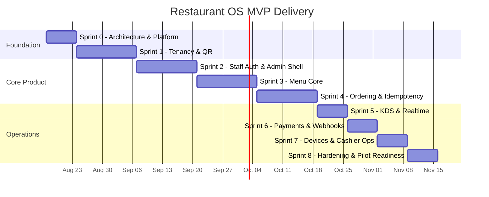

# Restaurant OS — Delivery, Quality & Operations

**Document ID:** ROS-DEL-001  
**Status:** Canonical MVP execution plan  
**Delivery baseline:** 12 weeks + controlled pilot

---

## 1. Delivery strategy

The MVP is delivered in vertical slices. Foundation work is front-loaded, but each sprint should leave deployable, testable capability rather than isolated technical components.

### Team assumption from source material

- Product Manager
- Technical Lead / Architect
- Backend Engineers
- Frontend Engineers
- Device/KDS owner
- Platform/DevOps
- QA

A dedicated mobile driver engineer is not needed for MVP because driver capability is post-MVP.

## 2. 12-week roadmap

The dates above are illustrative sequencing beginning after this documentation baseline; sprint durations, not calendar dates, are authoritative.

## 3. Sprint 0 — Architecture & platform foundation

### Objectives

- finalize architectural decisions;
- establish repository and CI;
- establish staging infrastructure;
- create base migrations;
- establish coding/security quality gates.

### Required deliverables

- ADR-001 backend framework
- ADR-002 real-time strategy
- ADR-003 event/outbox strategy
- ADR-004 device protocol direction
- repository structure
- local dev environment
- CI pipeline
- Terraform/IaC skeleton
- staging environment
- logging/tracing baseline
- initial tenant/branch/table schema
- idempotency/webhook table migrations
- API error contract

### Exit criteria

- application deploys to staging;
- health/readiness endpoints work;
- migration executes automatically;
- CI blocks failing unit/lint/security checks.

## 4. Sprint 1 — Tenancy, branch, table and QR

### Scope

- tenant model
- branch model
- table model
- QR token resolution
- table session baseline
- tenant context middleware
- PostgreSQL RLS initial policies
- public menu stub/cache path

### Exit criteria

- tenant A cannot access tenant B in automated tests;
- QR resolves correct context;
- disabled QR safe failure;
- first branch menu stub accessible through edge path.

## 5. Sprint 2 — Staff identity and admin shell

### Scope

- staff OTP request/verify
- access + refresh session
- refresh-token persistence
- role model
- session revocation
- staff invite
- admin navigation shell
- owner/manager onboarding path

### Exit criteria

- role authorization tests exist;
- revoked session cannot refresh;
- owner can enter configured tenant admin.

## 6. Sprint 3 — Menu core

### Scope

- categories
- items
- modifiers
- combos
- tenant catalogue
- branch overrides
- availability/86
- image reference
- dietary/allergen metadata
- public effective menu
- cache invalidation

### Exit criteria

- manager creates tenant-level item;
- branch override displays correctly;
- stale client cannot checkout unavailable item;
- menu E2E/admin tests pass.

## 7. Sprint 4 — Ordering and idempotency

### Scope

- cart
- cart items
- customer OTP
- server-side validation
- authoritative totals
- checkout
- idempotency middleware
- order/order item snapshots
- status history
- OrderCreated event

### Exit criteria

- timeout/retry test produces exactly one order;
- financial snapshot tests pass;
- order event occurs only after persistence;
- critical customer flow works to order confirmation without online payment.

## 8. Sprint 5 — KDS and real-time operations

### Scope

- KDS PWA
- branch-scoped connection
- order queue
- item status
- prep timer/SLA warning
- reconnect banner
- queue resync endpoint
- polling fallback

### Exit criteria

- order visible <3 seconds p95 under test load target;
- disconnect/reconnect test preserves state;
- cross-branch socket access denied.

## 9. Sprint 6 — Payments and webhooks

### Scope

- payment provider adapter
- Stripe reference implementation
- PaymentIntent/reference create
- online checkout integration
- webhook signature verification
- dedupe
- reconciliation
- refund API/UI for manager
- audit record

### Exit criteria

- duplicate payment request safe;
- duplicate webhook safe;
- invalid webhook signature rejected;
- refund limit enforced;
- sandbox reconciliation passes.

## 10. Sprint 7 — Devices, printing and cashier operations

### Scope

- Device Agent registration/auth
- capabilities
- print command
- durable local queue
- print-token dedupe
- heartbeat
- device health admin
- cashier-assisted ordering baseline
- controlled reprint/re-send workflow

### Exit criteria

- simulated internet outage/restart does not duplicate print token;
- command resumes after reconnect;
- device health visible;
- cashier can create supported order.

## 11. Sprint 8 — Hardening and pilot readiness

### Scope

- performance/load tests
- security scans
- complete RLS negative tests
- failure injection for KDS/device/payment retry
- production dashboards/alerts
- runbooks
- onboarding playbook
- backup/restore validation
- release/rollback drill
- pilot data/configuration

### Exit criteria

All pilot release gates pass.

## 12. Post-MVP roadmap

### Phase 2 — Growth

- F8 inventory
- F9 delivery/driver
- F10 loyalty/promotions/split tender
- F11 analytics/reporting
- richer cashier/server workflows
- POS adapters

### Phase 3 — Enterprise

- F12 enterprise controls
- SSO
- franchise hierarchy
- advanced permissions
- configurable data retention/export
- optional stronger tenant isolation topology
- F13 AI after governance ADR

## 13. CI/CD pipeline

```mermaid
flowchart LR
    PR["Pull Request"] --> L["Lint / Static Analysis"]
    L --> U["Unit Tests"]
    U --> I["Integration Tests"]
    I --> C["Contract Tests"]
    C --> S["Security / Dependency Scan"]
    S --> B["Build Artifact"]
    B --> STG["Deploy Staging"]
    STG --> E2E["E2E / Smoke"]
    E2E --> A["Production Approval"]
    A --> PROD["Deploy Production"]
    PROD --> V["Post-deploy Verification"]
```

### Branch strategy

Use trunk-based development with short-lived branches and protected `main`.

### Required PR checks

- formatting/lint
- compilation/type checks
- unit tests
- relevant integration tests
- contract tests
- dependency/security checks
- migration validation
- code review

## 14. Test strategy

### Unit

Business rules:

- totals
- modifiers
- tax/fee calculations
- state transitions
- permission policy
- idempotency request-hash behavior

### Integration

Real infrastructure-compatible test environments for:

- PostgreSQL
- Redis
- queue/event behavior
- RLS
- transactions/outbox
- session/token persistence

### Contract

- Stripe/payment provider
- SMS provider
- Device Agent protocol
- future POS adapters

### E2E

Critical journey:

`QR → menu → cart → OTP → checkout → payment where applicable → order persisted → KDS → preparing → ready`

Additional E2E:

- pay at counter
- refund
- KDS reconnect
- device offline/reconnect
- branch menu override
- revoked staff session

### Load/performance

- public menu
- checkout
- KDS fan-out
- queue backlog recovery
- 500 concurrent active seats as an initial source-defined scenario, refined using pilot capacity assumptions.

## 15. Quality gates

### Pilot blocker

- failing tenant isolation
- duplicate charge/order behavior
- payment reconciliation failure
- KDS lost-state regression
- Device Agent duplicate-print regression
- critical E2E failure
- critical security finding

### Code coverage

Coverage percentage is not a release objective by itself. Critical business invariants require direct tests regardless of aggregate coverage.

## 16. Environments

Minimum:

- local/developer
- CI ephemeral/test
- staging
- production

Payment/SMS/provider credentials must be environment-specific.

## 17. Database migration policy

- forward-compatible changes first;
- nullable/additive migration before code dependency when possible;
- destructive changes separated and explicitly approved;
- migration must be tested against representative data;
- rollback/recovery plan required for high-risk schema changes;
- no manual production schema edits outside controlled procedure.

## 18. Release strategy

For pilot:

- controlled restaurant onboarding;
- production release during staffed support window;
- explicit go/no-go checklist;
- rapid rollback capability;
- feature flag for risky/incomplete optional behavior where appropriate.

## 19. Operational dashboards

### Product operations

- orders/min
- checkout success/failure
- payment state
- refund state
- KDS latency
- preparation time

### Platform

- API error/latency
- DB saturation
- queue age/depth
- WebSocket connections
- webhook errors
- Device Agent heartbeat
- DLQ

## 20. Required runbook index

- `runbook-payment-provider-incident.md`
- `runbook-payment-reconciliation.md`
- `runbook-kds-outage.md`
- `runbook-device-agent-offline.md`
- `runbook-printer-command-failure.md`
- `runbook-database-failover.md`
- `runbook-queue-backlog.md`
- `runbook-security-tenant-isolation-incident.md`
- `runbook-production-rollback.md`

## 21. Ownership model

| Area | Accountable | Responsible |
|---|---|---|
| Product scope/acceptance | Product Manager | Product + Design |
| Architecture/ADRs | Technical Lead | Senior Engineering |
| Tenancy/order/menu | Backend Lead | Backend Engineers |
| Customer/Admin/KDS UI | Frontend Lead | Frontend Engineers |
| Payments | Payments owner | Backend Engineer |
| Devices | Device/KDS owner | Integration Engineer |
| CI/Infra/Observability | Platform Lead | DevOps/Platform |
| Test automation | QA Lead | QA + Engineers |
| Security gates | Security/Tech Lead | Engineering + Platform |

## 22. MVP go/no-go checklist

- [ ] All P1 stories accepted
- [ ] Cross-tenant tests pass
- [ ] Checkout idempotency retry test passes
- [ ] Duplicate webhook test passes
- [ ] Refund constraint verified
- [ ] KDS reconnect/resync verified
- [ ] Device Agent restart/offline test verified
- [ ] Payment sandbox reconciliation passes
- [ ] Load targets meet pilot baseline
- [ ] Dashboards and alerts active
- [ ] Required runbooks reviewed
- [ ] Backup/restore procedure verified
- [ ] No critical security findings
- [ ] Pilot restaurant onboarding checklist completed
