# Restaurant OS — End-to-End Design Flow

**Document ID:** ROS-FLOW-001
**Status:** Proposed (companion to ROS-STACK-001; pending ADR-001)
**Owners:** Technical Lead, Backend Lead, Frontend Lead
**Reads with:** `ROS-ARCH-001` (architecture), `ROS-DATA-001` (data and events), `ROS-STACK-001` (tech stack)

---

## 1. How to read this document

This is the single end-to-end picture of Restaurant OS: every entry point, every stage of the critical journey, every exit state, and the concrete technology carrying each step. It expands the flows that `ROS-ARCH-001` sections 7 to 10 describe in prose and binds them to the stack proposed in `ROS-STACK-001`.

The diagrams are layered:

- **Section 3** — actors, entry points and exit states.
- **Section 4** — the whole critical journey on one canvas.
- **Section 5** — the request lifecycle that wraps *every* call.
- **Sections 6 to 13** — one stage each, in depth, with the failure and recovery branches.
- **Section 14** — deployment topology and the pipeline that ships it.

Legend for the stack labels used throughout:

| Shape | Meaning |
|---|---|
| Rectangle | Service, app or process |
| Rounded / stadium | Managed edge or broker |
| Cylinder | Datastore |
| Diamond | Decision or guard |
| Dashed edge | Asynchronous or best-effort path |

---

## 2. Stack touchpoints at a glance

| Stage | Frontend | Backend / worker | Data / infra | External |
|---|---|---|---|---|
| Browse and cart | customer-web (React 19, Vite) | FastAPI `public` router | Valkey cache, PostgreSQL, Cloudflare CDN | — |
| Identity / OTP | customer-web, admin-web | FastAPI `identity`, `SmsProvider` port | Valkey counters, PostgreSQL `otp_verifications` | Twilio / AWS SNS |
| Checkout | customer-web | FastAPI `ordering` + idempotency middleware | PostgreSQL (order, order_items, outbox, idempotency_keys), Valkey lock | — |
| Payment | customer-web (Stripe Payment Element) | FastAPI `payments`, `PaymentProvider` port | PostgreSQL `payments`, `webhook_events` | Stripe |
| Event fan-out | — | Dramatiq worker, outbox drainer | PostgreSQL outbox, RabbitMQ, Valkey Pub/Sub | — |
| KDS real-time | kds-pwa (React, vite-plugin-pwa) | FastAPI SSE endpoint + `kitchen` router | Valkey Pub/Sub, PostgreSQL projection | — |
| Printing | admin-web (reprint control) | FastAPI `devices`, Dramatiq dispatch | PostgreSQL `device_commands`, `device_agents` | Device Agent (python-escpos, SQLite) → printer |
| Settlement / exit | customer-web status view, admin-web | FastAPI `ordering`, `payments`, APScheduler reconcilers | PostgreSQL immutable snapshots, R2 archive | Stripe (refunds) |
| Cross-cutting | all apps | FastAPI middleware chain | Traefik, Cloudflare WAF, OpenTelemetry to SigNoz | — |

---

## 3. Actors, entry points and exit states

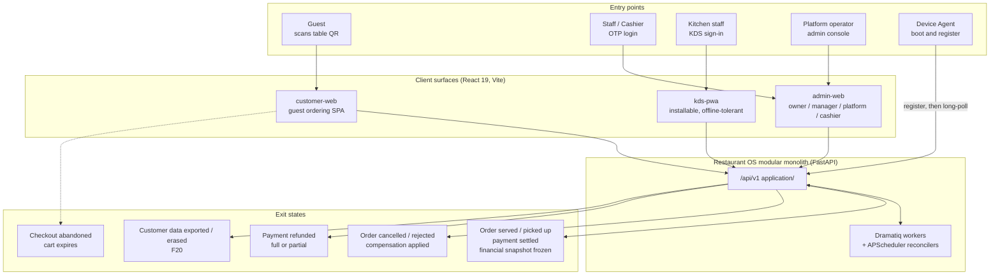

Entry is always guest-first (`ROS-PRD-001` ND-04): browsing and cart building need no account. Exit is reached only when the order is in a terminal state *and* payment is reconciled from the provider, never from a client response alone.

---

## 4. The critical journey, end to end

This is the path in `ROS-DEL-001` section 14: `QR to menu to cart to OTP to checkout to payment to order persisted to KDS to preparing to ready`, plus print and settlement. Downstream kitchen and device effects are never created before durable order state exists (`ROS-ARCH-001` section 7 invariant).

```mermaid
flowchart TD
  A["Guest scans QR"] --> B{"QR token valid?<br/>FastAPI public router"}
  B -->|"no"| BX["Reject safely<br/>no sequential IDs leaked"]
  B -->|"yes"| C["Resolve tenant / branch / table<br/>GET /public/qr/token/context"]

  C --> D["Load effective menu<br/>GET /public/menu/branchId"]
  D --> D1{"Cloudflare edge hit?"}
  D1 -->|"yes"| E["Render menu<br/>customer-web"]
  D1 -->|"no"| D2{"Valkey cache hit?"}
  D2 -->|"yes"| E
  D2 -->|"no"| D3["Resolve tenant + branch overrides<br/>SQLAlchemy on PostgreSQL"] --> D4["Warm Valkey + edge"] --> E

  E --> F["Build cart<br/>Zustand persist, POST /carts, Pydantic validation"]
  F --> G{"Checkout flow needs identity?"}
  G -->|"yes"| H["Customer OTP<br/>request + verify, Twilio via SmsProvider"]
  G -->|"no"| I
  H --> I["Checkout<br/>POST /carts/id/checkout + Idempotency-Key"]

  I --> J["Idempotency middleware<br/>Valkey lock + PostgreSQL idempotency_keys"]
  J --> K{"Key seen before?"}
  K -->|"yes, same body"| KR["Return original result"] --> R
  K -->|"yes, different body"| KE["409 IDEMPOTENCY_KEY_REUSED"]
  K -->|"no"| L["One DB transaction:<br/>recalc totals, create order + order_items snapshots,<br/>write outbox row"]
  L --> M["Commit"]

  M --> N{"Branch payment mode"}
  N -->|"pay_at_counter"| P1["Order status: awaiting counter payment"]
  N -->|"pay_online / both"| O["Create PaymentIntent<br/>Stripe via PaymentProvider port"]
  O --> O1["Stripe Payment Element<br/>tokenized, hosted fields"]
  O1 --> O2["Stripe webhook<br/>POST /webhooks/stripe"]
  O2 --> O3["Verify signature, dedupe on webhook_events,<br/>reconcile payment state"]

  M --> Q["Outbox drainer (Dramatiq)<br/>publish order.created.v1"]
  P1 --> Q
  O3 --> Q
  Q --> Q1["RabbitMQ to Valkey Pub/Sub"]
  Q1 --> Q2["SSE push to kds-pwa<br/>p95 under 3s, NFR-002"]
  Q2 --> S["Kitchen progresses items<br/>PATCH /order-items/id/status<br/>pending to preparing to ready"]

  M --> T["Device command created<br/>unique print_token, PostgreSQL device_commands"]
  T --> T1["Dramatiq dispatch"] --> T2["Device Agent pulls<br/>python-escpos, dedupe by token"] --> T3["Physical ticket prints"]

  S --> R["Customer status view<br/>GET /orders/id/status"]
  T3 --> R
  R --> U["Order served / picked up"]
  U --> V["Settlement<br/>immutable financial snapshot, INV-005"]
  V --> W["EXIT: complete"]
  P1 -.->|"counter payment recorded"| O3
```

---

## 5. Cross-cutting request lifecycle

Every authenticated call passes this chain before it reaches domain code. It implements `ROS-SEC-001` sections 3 and 9 and `ROS-PRD-001` NFR-005 and NFR-007.

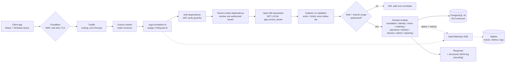

RLS is defense in depth: the `app.current_tenant` setting plus policies on every tenant-scoped table backs up the explicit authorization check, it does not replace it (`ROS-ARCH-001` section 12).

---

## 6. Stage A — Browse and cart

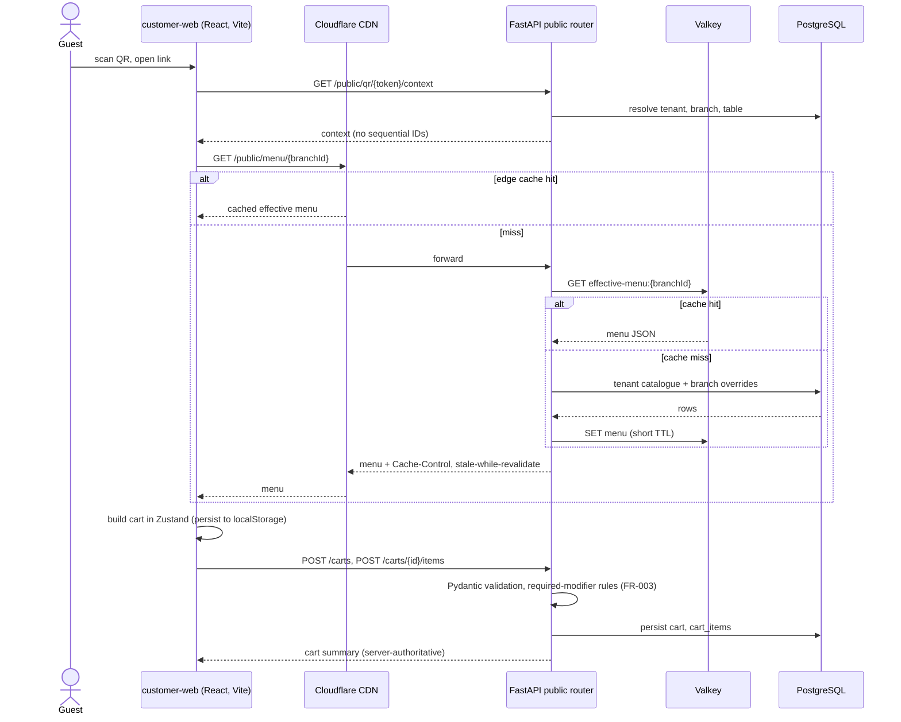

**Recovery:** a menu mutation emits `menu.changed.v1`, which purges the Cloudflare tag and the Valkey key for the affected branch. A stale client that tries to check out an unavailable item is rejected at checkout, not here (FR-002, `ROS-DEL-001` Sprint 3 exit criteria).

---

## 7. Stage B — Identity and OTP

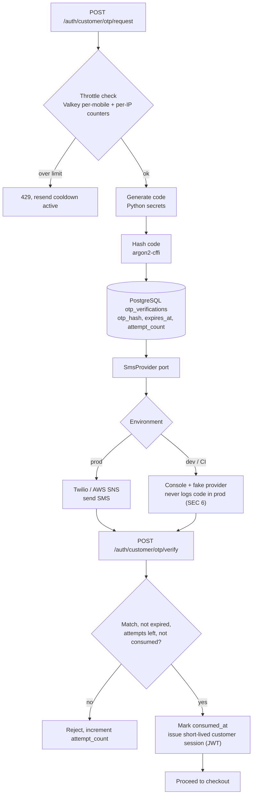

Staff identity is the same shape with an access plus refresh pair; the refresh token is stored only as an argon2 hash in `staff_refresh_tokens`, and is rotated and revocable (`ROS-SEC-001` section 4, FR-012).

---

## 8. Stage C — Checkout, idempotency and outbox

The correctness core. The event row is written in the *same* transaction as the order, so no event can exist without durable state and vice versa (`ROS-ARCH-001` section 13, ADR-003).

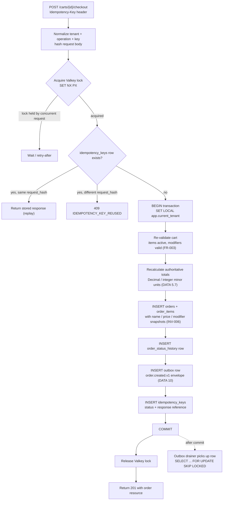

**Guarantee tested (`ROS-DEL-001` Sprint 4 exit):** a timeout-and-retry storm on one `Idempotency-Key` produces exactly one order; a crash after `COMMIT` but before publish is recovered by the drainer, because the outbox row is already durable.

---

## 9. Stage D — Payment and webhook reconciliation

```mermaid
sequenceDiagram
  participant CW as customer-web
  participant API as FastAPI payments
  participant PP as PaymentProvider port
  participant ST as Stripe
  participant PG as PostgreSQL
  participant REC as APScheduler reconciler

  CW->>API: POST /orders/{id}/payments/intent (Idempotency-Key)
  API->>PP: create_intent(amount, currency, idem key)
  PP->>ST: PaymentIntent.create
  ST-->>PP: client_secret, provider_ref
  PP-->>API: intent
  API->>PG: INSERT payments (status = requires_payment)
  API-->>CW: client_secret
  CW->>ST: confirm via Stripe Payment Element (hosted fields)
  ST-->>CW: result (not trusted as settlement)
  ST->>API: POST /webhooks/stripe (async, signed)
  API->>API: construct_event (verify signature + timestamp)
  API->>PG: INSERT webhook_events (unique provider, event_id)
  alt duplicate event
    PG-->>API: conflict
    API-->>ST: 200 (no-op, dedupe INV-003)
  else new event
    API->>PG: UPDATE payments.status from provider truth
    API->>PG: INSERT outbox payment.updated.v1
    API-->>ST: 200
  end
  loop periodic
    REC->>PG: find payments with ambiguous local status
    REC->>ST: PaymentIntent.retrieve
    REC->>PG: reconcile, flag unresolved for operator (FR-007)
  end
```

Raw card data never reaches the backend (`ROS-SEC-001` section 7). Settlement state comes only from the provider webhook or the reconciler, never from the browser response.

---

## 10. Stage E — Event fan-out and KDS real-time

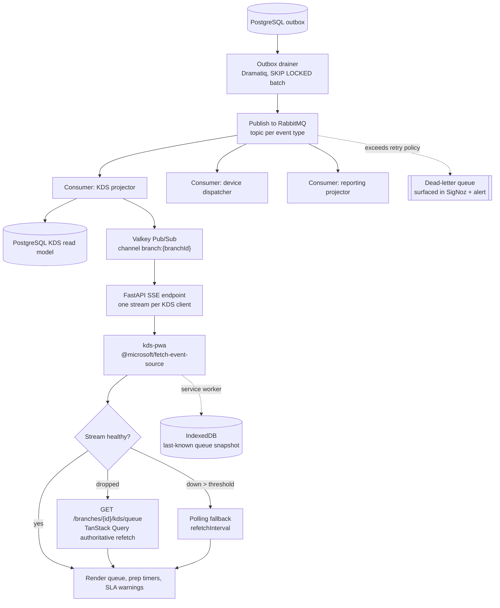

Real-time transport is an optimization, not the system of record (`ROS-ARCH-001` section 9). Duplicate event application is harmless by design; the read model is idempotent on event ID and aggregate version (DATA section 12).

---

## 11. Stage F — Kitchen item progression

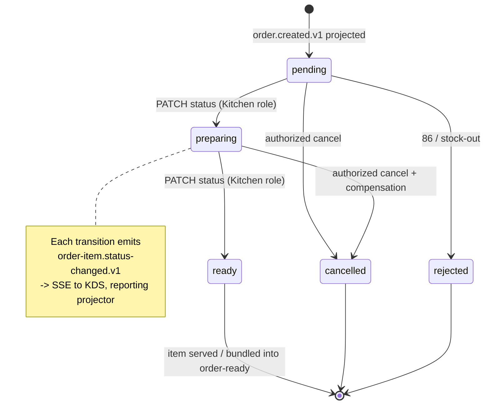

Order preparation status and payment status are separate state machines; a payment webhook must not invent kitchen state (`ROS-PRD-001` section 8).

---

## 12. Stage G — Printing and the Device Agent

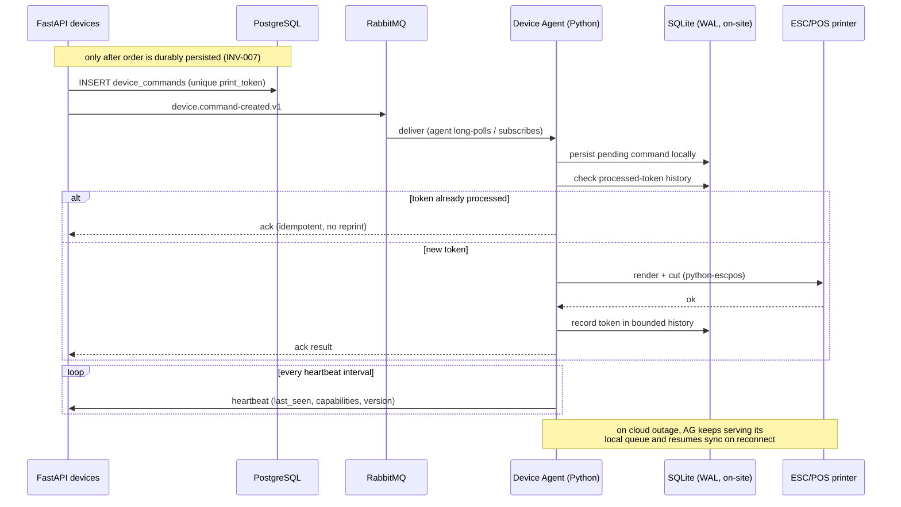

Cloud retries of the same `print_token` never produce a second physical ticket; the agent dedupes locally (`ROS-ARCH-001` section 10, FR-010).

---

## 13. Stage H — Exit: settlement, refund, data lifecycle

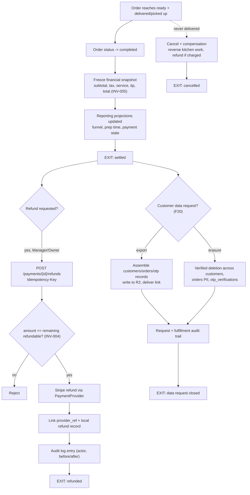

---

## 14. Deployment topology and delivery pipeline

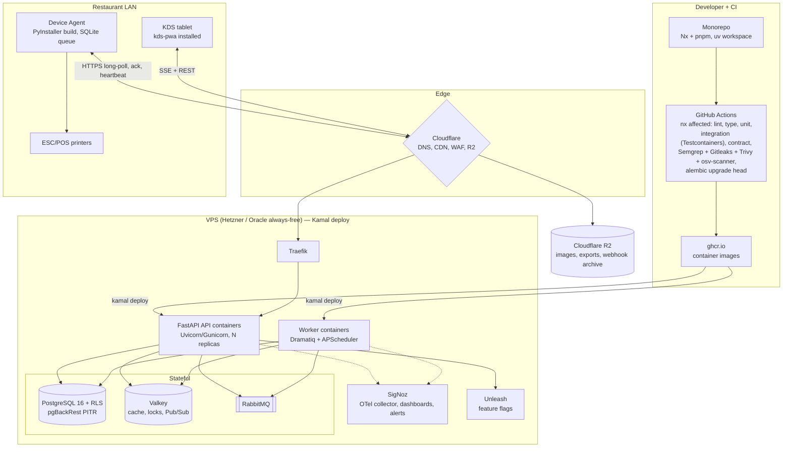

Static frontend bundles (`customer-web`, `admin-web`, `kds-pwa`) build in CI and deploy to Cloudflare Pages / R2 behind the same CDN; only the API and workers run on the host. Extraction of any component (real-time gateway, device service, reporting pipeline) stays a later, evidence-driven ADR (`ROS-ARCH-001` section 14).

---

## 15. Traceability

| Diagram | Canonical source |
|---|---|
| Section 4 critical journey | `ROS-DEL-001` section 14, `ROS-ARCH-001` sections 7 to 8 |
| Section 5 request lifecycle | `ROS-SEC-001` sections 3, 9; `ROS-PRD-001` NFR-005, NFR-007 |
| Section 8 checkout / outbox | `ROS-ARCH-001` section 13; `ROS-DATA-001` sections 9, 13; INV-002 |
| Section 9 payment | `ROS-PRD-001` FR-006, FR-007; `ROS-SEC-001` sections 7, 8 |
| Section 10 KDS real-time | `ROS-ARCH-001` section 9; `ROS-DATA-001` section 12; NFR-002 |
| Section 12 Device Agent | `ROS-ARCH-001` section 10; `ROS-PRD-001` FR-010; INV-007 |
| Section 13 exit states | `ROS-PRD-001` FR-014; INV-004, INV-005; F20 |
| Section 14 topology | `ROS-ARCH-001` section 14; `ROS-DEL-001` sections 13, 16; `ROS-STACK-001` sections 15 to 18 |
