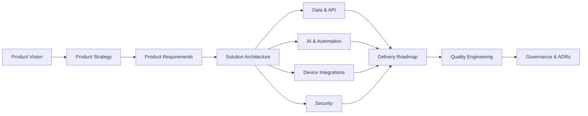

# Restaurant OS Documentation Hub

This repository is the structured source of truth for product strategy, requirements, architecture, integrations, security, delivery, and engineering governance.

## Documentation map

## Document ownership

| Area | Primary audience | Main outcome |
|---|---|---|
| Product Vision | Founders, product leadership | Shared direction and boundaries |
| Product Requirements | Product, design, engineering | Prioritised functional scope |
| Solution Architecture | Architects, senior engineers | Technology and system decisions |
| Security | Security and engineering | Controls and compliance posture |
| Device Integrations | Integration and mobile teams | Reliable POS, printer, KDS and terminal connectivity |
| Delivery Roadmap | Leadership and delivery teams | Phases, milestones and dependencies |
