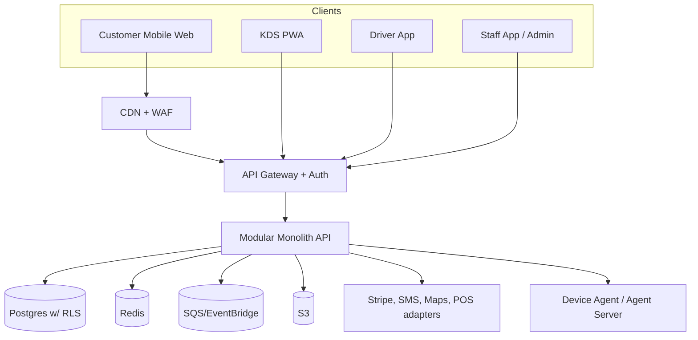
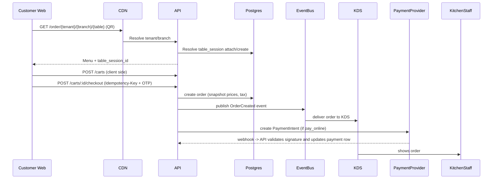

# Restaurant OS — Complete Master Requirements & Architecture

This file is the canonical, engineering-grade master plan for Restaurant OS. It consolidates product vision, personas, requirements, data model highlights, API contracts, flows, device/KDS and driver details, security and compliance rules, CI/CD and runbooks, testing and acceptance criteria, and a detailed 12-week delivery roadmap. Implementers must follow these specs; any deviation requires an ADR.

Contents
- Executive summary
- Personas and roles (complete)
- System overview and architecture
- Data model key tables and invariants
- API surface and critical contracts
- Ordering, Table Session, and Payment flows (sequence diagrams)
- KDS, Device Agent, and Printer flows
- Delivery & Driver workflows
- Inventory, Combos, and Menu models
- Security, Tenancy, and Compliance
- Observability, Runbooks and Incident responses
- Testing strategy and release gates
- 12-week sprint plan, deliverables and ownership
- Migration and backward-compatibility notes

---

Executive summary
Restaurant OS is a multi-tenant SaaS Restaurant Operating System: ordering, payments, menu management, kitchen orchestration, device integrations, inventory and delivery operations, and operator admin. Launch as a modular monolith with explicit module boundaries to accelerate delivery and reduce distributed system complexity initialy, then extract high-throughput services as load dictates.

Primary non-functional targets (MVP):
- Availability: 99.5% (internal target)
- Order delivery latency to KDS: <3s (95th percentile)
- Checkout success rate: >99.5% under pilot load
- No cross-tenant data leaks (RLS + contract tests)

Personas & Roles (complete)
- Customer (diner): Browses menu, orders, pays, receives notifications. Guest-first mobile web flow.
- Staff (roles):
  - Owner: full access
  - Manager: menu, refunds, reports, staff invites
  - Cashier: create orders, accept payments, close shifts
  - Kitchen: view and update order-item status
  - Server: manage table sessions, transfer/merge/split
  - Driver: accepts deliveries, navigates to destination, updates status and POD (proof of delivery)
- Platform operator: Onboards tenants, manages subscription and support
- Platform admin/support: observability, runbook execution, tenant suspend/reactivate

Notes: driver is a first-class role with mobile client requirements and device permissions. Driver accounts are tenant-scoped but may be external contractors. Driver authentication includes verification and driver onboarding data (vehicle, license) stored in driver_profiles.

System overview and architecture

- Deployable topology (initial): Modular Monolith (Spring Boot) running on ECS Fargate; PostgreSQL with RLS; Redis for caching; SQS/EventBridge for async; S3 for object storage; WebSocket gateway for KDS.

Mermaid diagram (high-level)

Service decomposition (modules)
- Foundation: tenancy, branches, tables, QR service
- Identity: staff auth (JWT + refresh) and customer short sessions (OTP table-session)
- Menu: items, modifiers, combos, overrides, availability windows
- Ordering: carts, orders, order_items, order_status_history, idempotency
- Payments: PaymentIntent orchestration, provider adapters, refunds, reconciliation
- Kitchen: KDS publisher, station routing, SLA calculations, expediter
- Devices: DeviceAgent protocol, print command queue, heartbeat
- Delivery: driver onboarding, trip dispatch, ETA, proof-of-delivery
- Inventory: raw materials, recipes, stock, transfers (growth)
- Admin & Reporting: platform console, tenant admin, analytics
- AI Layer: recommendation assistant, constrained to tool-calls/function-calls against the live API

Data model — key tables & invariants
(Full DDL lives in docs/backend/database-schema.md; below are critical excerpts and invariants.)

- tenants(id PK, slug, name, currency, timezone, subscription_plan)
- branches(id PK, tenant_id FK, name, address, tax_rate, payment_mode ENUM(pay_online, pay_at_counter, both))
- restaurant_tables(id PK, tenant_id, branch_id, table_number, qr_token, capacity)
- table_sessions(id PK, tenant_id, branch_id, status ENUM(open,closed), opened_at, closed_at)
- session_participants(id PK, table_session_id, customer_id, guest_label)
- customers(id PK, tenant_id, mobile, name, verified_at)  -- UNIQUE(tenant_id, mobile)
- staff(id PK, tenant_id, branch_id nullable, role ENUM, mobile, last_login_at)
- staff_refresh_tokens(id PK, staff_id, token_hash, device_info, revoked_at)
- otp_verifications(id PK, tenant_id, mobile, otp_code_hash, purpose, attempts, expires_at)
- menu_items(id PK, tenant_id, branch_id nullable, name, price_snapshot, allergens[], is_veg, is_vegan, is_halal, last_modified)
- menu_item_overrides(id PK, menu_item_id FK, branch_id FK, price, is_available)
- modifier_groups/options, combo_items/combo_components
- carts, cart_items (menu_item_id or combo_item_id), cart snapshots
- orders(id PK, tenant_id, branch_id, table_session_id nullable, customer_id nullable, subtotal, tax_amount, service_charge, tip_amount, total_amount, notes TEXT, flagged_suspicious BOOLEAN, placed_at)
- order_items(id PK, order_id FK, menu_item_id or combo, item_name_snapshot, unit_price_snapshot, quantity, selected_modifiers JSONB, special_instructions, line_total, status ENUM(pending,preparing,ready,rejected))
- order_status_history(id PK, order_id FK, status, changed_by_staff_id, changed_at)
- payments(id PK, order_id FK, tenant_id, method, provider, provider_ref, amount, status, paid_at)
- refunds(id PK, payment_id FK, amount, reason, processed_by_staff_id)
- idempotency_keys(id PK, tenant_id, key UNIQUE, request_hash, response_body, status_code, created_at)
- webhook_events(id PK, provider, event_id UNIQUE, processed_at)
- device_tokens (for push), device_agents (heartbeat, last_seen, capabilities)
- audit_logs(id PK, tenant_id, actor_staff_id, action, entity_type, entity_id, before_state, after_state, created_at)

Invariants:
- tenant_id present on all tenant-scoped rows
- idempotency_keys unique per tenant
- webhook_events.event_id unique per provider
- SUM(refunds.amount) <= SUM(payments.amount) for an order — enforce this transactionally
- Order financial snapshots (unit_price_snapshot, tax_amount) immutable after settlement

API surface & critical contracts
(Only highlights; full endpoints in API docs)

Public Customer APIs:
- GET /public/menu/:branchId  (cached at CDN + client)
- POST /carts  (create client-side cart server-backed)
- POST /carts/:id/items
- POST /carts/:id/checkout  (requires Idempotency-Key header where payment occurs)
- POST /auth/customer/otp/request
- POST /auth/customer/otp/verify
- GET /customers/me/orders

Staff & Admin APIs:
- POST /auth/staff/otp/request
- POST /auth/staff/otp/verify
- POST /platform/tenants
- POST /tenants/:tenantId/branches
- POST /branches/:id/categories, POST /categories/:id/items
- PATCH /items/:id/availability
- GET /branches/:id/kds/queue
- WS /ws/branches/:id/kds
- POST /orders/:id/payments/intent  (requires Idempotency-Key)
- POST /webhooks/stripe

API rules (non-negotiable):
- Standard error payload: { error: { code, message, details } }
- Authentication: customers get short-lived session tokens scoped to table_session_id; staff get JWT access tokens + refresh tokens persisted
- Idempotency: All POSTs that create kitchen-facing or chargeable records must accept Idempotency-Key and persist it (idempotency_keys) with the response body
- Webhook dedupe: provider events saved in webhook_events and processed only once
- Versioning: /api/v1; deprecation policy defined in ADR

Ordering, Table Session and Payment flows

Sequence: Guest dine-in ordering (simplified)

Payment & webhook dedupe (notes):
- Server must create PaymentIntent server-side and return client_secret to customer for client to confirm via provider SDK.
- Webhook processing must record event_id in webhook_events and ignore duplicates.
- If webhook arrives before local state, handler must retry with exponential backoff but still dedupe by event id.

KDS, Device Agent & Printer flows

KDS
- Uses WebSocket (or SSE) subscriptions per branch with server-side broadcasting of order events.
- KDS client keeps last-known snapshot; on reconnect, client calls GET /branches/:id/kds/queue to resync missed changes.
- Reconnection UX: show ‘Reconnecting…’ banner and stale queue, allow local/manual refresh.

Device Agent (local)
- DeviceAgent runs on local network (or on device hardware) and polls/pulls commands or connects via secure channel.
- Cloud sends PrintCommand containing order_id and print_token.
- DeviceAgent persists command queue and dedupes by print_token. On reconnect it replays pending commands and acknowledges receipt.
- Device heartbeat recorded to device_agents table; admin UI shows device health and last_seen.

Printer reliability rules
- Order must be persisted prior to sending any device command.
- All print requests carry print_token for idempotency.
- In case of offline device, operator can re-send last N commands from admin UI.

Delivery & Driver workflows

Driver role responsibilities
- Accept/decline assigned delivery jobs
- Navigate to pickup location using maps integration
- Mark pickup complete, in-transit, arrived, delivered
- Capture proof of delivery (photo signature) and optionally a tip/adjustment
- Report issues and exception handling (failed delivery)

Driver onboarding
- Driver_profile table: driver_id, tenant_id, name, phone, vehicle_type, license_number (encrypted), background_check_status
- Driver must complete onboarding steps; admin approves driver before enabling account
- Driver auth: OTP + device token; driver session tokens scoped with driver_role claims

Dispatch & ETA
- Dispatch service uses branch location, driver current location, and route ETA (Maps API) to assign job to nearest available driver
- Driver app reports location at frequency based on plan (e.g., 10s) and platform throttles density to conserve battery
- Driver app receives job via push notification and can accept/decline; upon accept, job is assigned and visible to customer tracking UI

Delivery invariants
- Order type for delivery must have delivery_address and contact; orders for delivery require payment method per branch policy
- Proof-of-delivery stored in deliveries table with provider_ref and POD artifact (image URL)
- Failed-delivery workflow: attempt_count, reassign or return to merchant, refund or retry policy

Inventory, Combos and Menu details

Combos and bundles
- combo_items table with price and component links to menu_item IDs; order_items may reference menu_item or combo_item

Inventory
- inventory_items: raw materials with uom, stock_quantity
- recipe_components: menu_item -> inventory_items with yield and usage per order
- For MVP inventory is optional: manual 86'ing remains primary; inventory auto-decrement planned for Phase 2

Menu availability
- menu_availability_windows for time-based windows; menu_item_overrides for branch-specific pricing or availability
- allergens[] and dietary flags are first-class fields on menu_item and used by AI and UI filters

Security, tenancy and compliance
- Postgres Row-Level Security (RLS) policies on tenant-scoped tables using session variable: SET app.tenant_id
- Secrets: central secret manager (e.g., AWS Secrets Manager)
- PCI: server never touches PAN; client uses Stripe Elements/Payment Element
- Webhook validation: verify signature headers and process idempotently
- Encryption: PII encrypted at rest (field-level where required); driver license and payment tokens encrypted
- RBAC: fixed permissions map for MVP; tenant-customizable labels (not permissions) to avoid complex RBAC engine early

Observability, runbooks and incident response

Logging & metrics
- Structured JSON logs, include tenant_id and request_id where available
- Traces via OpenTelemetry; metrics exported to CloudWatch/Prometheus
- Alerts: Payment failures rate, webhook failure spikes, KDS disconnections per branch, device agent heartbeats missing, increase in flagged_suspicious orders

Runbooks (minimum required)
- KDS outage: steps to failover, restart WS gateway, re-sync KDS clients
- Payment incident: pause new payments, reconcile pending intents, contact provider
- Device offline: notify operator, re-send queued commands after agent reconnects
- Cross-tenant leak suspicion: freeze offending service, collect logs, follow incident response playbook

Testing strategy and release gates
- Unit tests (business rules) — fast
- Integration tests (DB, Redis, queue) — CI
- Contract tests for Stripe, external adapters and device agent protocols
- E2E tests for QR ordering → checkout → KDS → ready → customer notification
- Load tests for menu endpoint and KDS fan-out (scenarios: 500 concurrent active seats)
- Security scanning and dependency checks

Release gates (all must pass before pilot)
- Idempotency & webhook dedupe contract tests passing
- RLS tests proving tenant isolation
- Payment reconciliation tests passing in sandbox
- Device agent basic reliability tests
- E2E critical path tests passing

12-week sprint plan (detailed)

Sprint 0 (Week 0): Foundations & Infra
- ADR: choose backend stack (Spring Boot recommended), DB, WS approach. Implement infra skeleton (Terraform). Establish CI pipeline and staging.
- Deliverables: repo scaffold, base migrations (tenants, branches, restaurant_tables with qr_token), idempotency_keys table created.

Sprint 1 (W1–W2): Tenancy & QR
- Implement tenant/branch APIs, QR generation & token resolution, table_sessions model, public menu stubs.
- Deliverables: GET /public/menu/:branchId, POST /table-sessions

Sprint 2 (W3–W4): Staff Auth & Admin Shell
- Staff OTP flows + staff_refresh_tokens, staff sessions endpoints, staff invite flow (SMS), admin UI skeleton.
- Deliverables: staff auth, staff sessions management endpoints

Sprint 3 (W5–W6): Menu Core
- menu_items, modifiers, combos, menu_item_overrides, admin UI for menu CRUD, cache invalidation on updates.
- Deliverables: menu CRUD, effective menu resolution logic

Sprint 4 (W7–W8): Customer Ordering E2E & Idempotency
- carts, cart_items, POST /carts/:id/checkout (persist idempotency_keys), OTP at checkout, order creation and snapshotting
- Deliverables: idempotency middleware, checkout flow tested

Sprint 5 (W9): KDS & Realtime
- WS /ws/branches/:id/kds publisher, GET /branches/:id/kds/queue, KDS PWA basic client
- Deliverables: KDS connection, item-level status updates

Sprint 6 (W10): Payments & Webhooks
- Stripe PaymentIntent integration, webhook processing with webhook_events dedupe, refunds flow
- Deliverables: payments test harness and reconciliation scripts

Sprint 7 (W11): Devices & Printing
- DeviceAgent protocol, PrintCommand queue and worker, device heartbeat UI
- Deliverables: device agent prototype, print idempotency

Sprint 8 (W12): Driver basic flows & Dispatch
- Driver onboarding, driver app skeleton, accept/decline job, basic dispatch (nearest driver)
- Deliverables: driver_profile, driver job assignment API

Sprint 9 (W13): Cashier operations & Refunds
- Cashier manual ordering, manage flagged_suspicious orders, refund approvals, audit logs

Sprint 10 (W14): Reporting & Export
- Implement branches/:id/reports endpoints, CSV export, compare_to parameter, funnel data capture

Sprint 11 (W15): Load & Security Hardening
- Load tests, security scans, RLS comprehensive tests, defensive rate limiting setup

Sprint 12 (W16): Pilot onboarding & hardening
- Pilot onboarding of 2 restaurants, operator playbooks, monitoring alerts tuned, iterate on pilot feedback

Ownership & team
- Product Manager (owner of acceptance criteria)
- Tech Lead (architect, ADR owner)
- Backend Engineers (2–4) split across modules
- Frontend Engineers (2) for Customer web + KDS + Admin
- Mobile Engineer (Driver app) or cross-platform implementation in Flutter
- DevOps/Platform (1–2): infra, CI, monitoring
- QA (1–2): contract, integration, E2E, load tests

Migration & backward-compatibility notes
- Additions required immediately: qr_token on restaurant_tables, idempotency_keys, webhook_events, order_items.status
- Backfills should be avoided where possible — create nullable columns first and migrate app logic to use new columns before backfilling

Open ADRs (must be resolved Sprint 0):
- Backend stack choice: Spring Boot (Java/Kotlin) recommended
- WebSocket strategy: native WS vs managed (Pusher) — pick one and implement reconnection policies
- Billing currency model for platform vs tenant (single platform currency recommended)
- AI vendor and cost cap policy before enabling AI features

Acceptance checklist for MVP sign-off
- All P1 stories implemented and automated tests exist
- Two pilot restaurants running for 7 consecutive days with no lost orders
- Payment reconciliation shows no duplicate charges in pilot samples
- KDS operates under pilot peak load with <1% message loss
- DeviceAgent reliability verified with local printer hardware in pilot locations

Appendices
- Appendix A: full endpoint reference (see docs/05-data-and-api/api-strategy.md backup)
- Appendix B: canonical DB schema (docs/backend/database-schema.md)
- Appendix C: CI pipelines & contract tests repo (internal)

---

This master file is authoritative. Next steps: convert open ADRs into entries and assign owners. Implementation should begin with Sprint 0 actions above. For any further refinements, ADRs must be created and approved.
