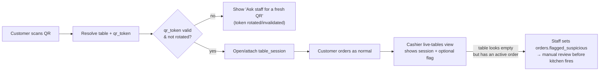
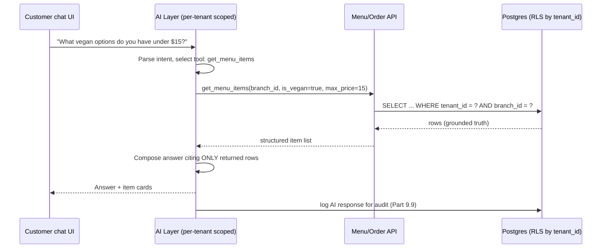

# Restaurant OS — Master Requirements & Architecture Document

> **How to read this doc:** every heading gives the technical spec first — the exact fields, endpoints, or rules an engineer implements — followed by a **"Plain-English Example"** block that shows *why* the spec looks the way it does, using a concrete scenario instead of jargon. Skip the examples if you already know the domain; read them first if a section doesn't click on the first pass.
>
> This revision merges everything from `docs/requirements/gap-analysis-and-roadmap.md` directly into the relevant sections below (menu catalog model, table-session security, AI grounding mechanism, schema/API deltas, etc.), so this file is now the single source of truth. The gap-analysis doc remains as a historical record of *why* each change was made, but nothing in it needs to be read separately anymore.

---

## Part 1: Product Vision

You are **not building a food delivery app** like Uber Eats. You are building a **Restaurant Operating System** — a multi-tenant SaaS platform where QR ordering is the first module of a larger system.

### 1.1 Platform Structure
```
Restaurant OS (SaaS Platform)
├── McDonald's
├── KFC
├── Domino's
├── George Cafe
└── ABC Restaurant
```
Each restaurant is a **Tenant**. Each tenant can have one branch, multiple branches, or franchise branches. One codebase, one database, one deployment serves every tenant — they are separated by a `tenant_id` column, not by separate installs.

**Plain-English Example**
Think of Restaurant OS like a shopping mall building, and each tenant like a store renting space in it. McDonald's and George Cafe both run on the exact same building infrastructure (elevators, wiring, security) — but McDonald's inventory never appears on George Cafe's shelves, and neither store can walk into the other's stockroom. In software terms: the same `orders` table holds rows for every tenant, but a McDonald's staff member's login can never return a George Cafe order, because every query is filtered by `tenant_id` behind the scenes.

### 1.2 Customer Experience — Core Principle
The customer never thinks about accounts. No password, no email, no registration.

```
Walk into Restaurant → Sit at Table → Scan QR → Menu Opens → Browse Items
→ Add to Cart → Checkout → Enter Name → Enter Mobile → Verify OTP → Pay
→ Kitchen Starts Preparing → Order Ready → Pick Up / Served
```

**Why OTP at checkout, not before menu:** Forcing login before browsing kills conversion. Customers should start ordering immediately; verification only gates the moment money/commitment is involved.

**Why verify mobile at all:** Prevents fake orders, enables "Order Ready" contact, enables refunds, enables order history — all without the overhead of a real account system.

**Plain-English Example**
Priya sits down at Table 7, scans the QR code, and is browsing the dessert menu twenty seconds later — no app download, no "create an account" screen. She adds a burger, fries, and a brownie to her cart. Only when she taps **"Place Order"** does the app ask for her name and phone number, then texts her a 6-digit code. She types it in, pays, and the kitchen ticket prints. If she'd closed the tab while just browsing, nothing was ever asked of her — the friction only shows up at the exact moment she's committing to spend money, which is the moment she's most willing to tolerate it.

### 1.3 Staff Experience — Core Principle
Staff **must** authenticate because they can manage menu, accept payment, update kitchen state, refund orders, and view sales.

```
Mobile Number → OTP → JWT → Dashboard
```
No passwords — same pattern as WhatsApp/Telegram login, but persistent (unlike the customer's one-time session).

**Plain-English Example**
Manager Maria opens the staff app on Monday morning, types her phone number, enters the OTP she's texted, and lands on the dashboard. She isn't asked to log in again on Tuesday — her session persists via a refresh token, just like staying logged into WhatsApp for months. Compare that to a customer's session: it dies the moment their table session closes, because a customer's identity only needs to last as long as their meal, while Maria's identity needs to last as long as her employment.

### 1.4 Staff Roles (MVP)
| Role | Can | Cannot |
|---|---|---|
| **Owner** | Everything | — |
| **Manager** | Menu, Orders, Refunds, Reports | Platform Settings |
| **Cashier** | Create Orders, Payments, View Orders | Edit Menu |
| **Kitchen** | View Orders, Change Status | Refund, Reports |
| **Server** | View Table Orders, Create Order, Request Bill | — |

**Plain-English Example**
Cashier Chen can ring up a walk-in order and take a card payment, but if he tries to change the price of a menu item through the API, the request is rejected with a 403 — his role token simply doesn't carry `menu:write`. If a customer disputes a charge, only Manager Maria (or the Owner) can issue the refund, because `refunds:write` isn't in the cashier's permission set. This is enforced server-side on every request, not just hidden in the UI — so even if Chen inspects the network traffic and replays the menu-edit request by hand, the API rejects it independently of what buttons his app happened to show him.

### 1.5 Authentication Strategy — Two Separate Systems
| | Customer | Staff |
|---|---|---|
| Flow | Guest → Mobile → OTP → Verified Session | Staff → Mobile → OTP → Access Token → Refresh Token |
| Session length | Tied to the order (short-lived) | Persistent login |
| Token type | Session token, no refresh | JWT access + refresh token |

**Recommendation carried through the whole design:** Treat Customers and Staff as two different identity systems even though both use mobile OTP. They have different lifecycles, permissions, and security requirements — separating them from day one makes it far easier to add loyalty, delivery, franchise, and enterprise features later without a rewrite.

**Plain-English Example**
Both Priya (customer) and Maria (manager) verify their phone with the exact same OTP screen — but under the hood they get handed completely different tokens. Priya's token is a short-lived pass that only unlocks *her table's* cart and order status, and it expires when her session closes. Maria's token is a long-lived, revocable credential like an employee badge — it survives across shifts and can be individually killed (e.g., if she loses her phone) without touching any customer's session. Merging these into "one login system" would mean a bug in customer auth could accidentally expose staff-level actions, or vice versa — keeping them apart is a safety boundary, not just a code-organization preference.

### 1.6 Multi-Tenant & White-Label Flow
```
Platform → Tenant → Branch → Table → Customer → Order → Kitchen → Payment
```
White-label is one backend, many brands — same APIs, different logo/theme/color/domain per tenant. A franchise is simply one Tenant with multiple Branches; no special architecture is needed.

**Plain-English Example**
When Priya scans the QR code at George Cafe, the menu page loads with George Cafe's logo and brown color scheme. Ten minutes later, someone scanning a QR code at a KFC branch hits the exact same backend, the exact same API routes, the exact same order state machine — but sees KFC's red branding instead. Nothing about the checkout logic, kitchen flow, or payment processing changes between the two; only `tenants.logo_url` and `tenants.primary_color` differ. That's the entire meaning of "white-label" here: one running system, wearing different storefronts.

### 1.7 MVP Modules
- **Foundation** — Tenant, Branch, Restaurant Tables, QR Management
- **Identity** — Staff Auth (OTP), Customer Verification (OTP), Roles & Permissions
- **Menu** — Categories, Items, Modifiers, Availability (86'd items)
- **Ordering** — Cart, Checkout, Orders, Order Status
- **Kitchen** — KDS, Order Queue, Status Updates
- **Payment** — Stripe, Webhooks, Refunds
- **Administration** — Dashboard, Today's Sales, Order Management

**Plain-English Example**
This list is the literal build order in Part 6's sprint plan: you can't build "Ordering" (Sprint 4) before "Foundation" and "Menu" exist, because an order needs a table to belong to and items to contain. Treat this list as a dependency chain, not a menu to pick from — each module is load-bearing for the one below it.

---

## Part 2: Platform Surfaces & Channel Decisions

*(New in this revision — merged from gap-analysis §2.2–§2.4 and §1. These are architecture-shaping decisions the original doc left implicit, and each one changes what gets built in Part 6's sprint plan.)*

### 2.1 Customer Ordering Channel: Web, Not a Native App
**The spec:** Customer-facing ordering (QR landing → menu → cart → checkout → order tracking) ships as a **responsive web app**, opened directly from the QR code URL — `/order/{tenant_slug}/{branch_id}/{table_id}`. No app-store install is required at any point in the customer flow. A native customer app, if built at all, is a **Phase 2 loyalty/push-notification companion**, not the MVP ordering surface. Staff, by contrast, install a native app once per device (already scoped correctly as native in the mobile structure doc) — install friction is a non-issue for someone who opens the app every shift for months.

**Plain-English Example**
* **The Broken Assumption:** Section 1.4's flutter mobile structure originally built a dedicated `customer_app` Flutter target, silently assuming every diner installs an app before ordering.
* **Why That Breaks the Product:** Part 1.2 already spends a whole section explaining that even a 6-digit OTP screen is enough friction to reason carefully about. An **app-store install** is a dramatically bigger drop-off point than an OTP screen — nobody downloads a 40MB app to order one meal at a table they're leaving in an hour. Every production QR-ordering product in this category (this is not a novel call) serves customers on mobile web for exactly this reason, and reserves native installs for staff, who use the app daily.
* **The Cleanest Fix:** Customers order straight from the web page that opens when they scan the code — zero install, zero App Store detour. The native app is for staff, who install once and benefit from it every single shift.

### 2.2 Two Frontends, Two Trust Boundaries
**The spec:** There are two separate web frontend projects, not one "frontend" folder shared between them:
1. A **customer ordering web app** — per-tenant, white-labeled, public, reached via QR (Part 2.1 above).
2. A **Platform Admin console** — internal-only, cross-tenant, used by the Restaurant OS operator's own staff (Part 2.3 below), never by a restaurant's customers.

These have different auth models (customer OTP session vs. platform staff login), different audiences, and different deploy cadences, and must be built and deployed as separate applications.

**Plain-English Example**
* **The Broken Assumption:** Nothing in the original doc set distinguishes these — a `docs/frontend/` folder exists but is empty, implying "the frontend" is one project.
* **Why That Breaks the Product:** One is a public page any diner can open by scanning a sticker; the other is a private control panel that can suspend a paying customer's entire restaurant. If they're "basically the same project" sharing a codebase and deploy pipeline, a bug in the public ordering page's build becomes a potential path into the internal admin tool.
* **The Cleanest Fix:** Two separate projects, two separate logins, two separate deployments from day one — a mistake in the public ordering site can never leak into the private admin console, because there's no shared surface for it to leak through.

### 2.3 Platform Admin / Super-Admin Module
**The spec:** `POST/GET/PATCH /platform/tenants` already exists as an API (Part 5), and "Platform" auth is already a fourth auth type — but no screen, workflow, or role model exists for the Restaurant OS company's own internal staff (support, sales, ops) who use it. This module needs, at minimum: a tenant list/search screen, a tenant detail view (plan, status, branches, usage), a suspend/reactivate action, and a written policy for what happens on trial expiry (warning email → grace period → auto-suspend, or similar — this is a product decision, tracked in Part 10).

**Plain-English Example**
* **The Broken Assumption:** There's already code that can add or remove a restaurant from the system — but nobody has designed a screen for it, like a car engine with no dashboard. It runs, but nobody can see or steer it.
* **Why That Breaks the Product:** Someone at the Restaurant OS company has to onboard new tenants and cut off non-payers. Today that "someone" would have to hand-write SQL or call the API with `curl` — not a sustainable support workflow past the first handful of tenants.
* **The Cleanest Fix:** Build one simple internal screen so support/sales staff can onboard restaurants and switch off non-payers, and write down exactly what happens, step by step, when a trial ends — so it's a documented policy, not a judgment call made under pressure the day someone stops paying.

---

## Part 3: Things Worth Locking Down Before Building

These are the decisions that are cheap to make now and expensive to retrofit later. *(Original items 3.1–3.7 below are unchanged in substance from the prior revision, now with worked examples added. Items 3.8 onward are merged in from the gap-analysis review.)*

### 3.1 Table Session Concept
The core problem is that the current system treats a restaurant order like an Amazon online checkout. It assumes one person sits down, buys their food once, and leaves.

In reality, dine-in eating is a shared, continuous event. People at the same table order drinks first, add appetizers later, order mains separately, and then split the bill.

**The Broken Assumption vs. Reality**
* **How it works if orders link straight to a table (Broken):** If Table 4 orders a burger, and then 10 minutes later orders a soda, the database sees two completely separate, unrelated orders. It has no idea those items belong to the same group of people eating together.
* **The Mess It Causes Later:** When the meal ends, the system cannot easily group the burger and soda onto a single bill. It cannot handle split checks, and it cannot track when a specific group actually arrived or left.

**The Cleanest Fix: The "Table Session" Hub**
Instead of linking orders to a physical piece of furniture (the table), link orders to a specific block of time (the session). A `table_session` is a digital tab that opens when a group sits down and closes when they pay.
```
table_sessions: id, tenant_id, branch_id, table_id, status (open/closed), opened_at, closed_at
```
Every order links to `table_session_id`, not directly to `table_id`.

```
 [ Physical Table 4 ]
          │
          ▼
  ┌────────────────────────┐
  │   table_sessions       │  <-- The Digital Tab (Opens at 7:00 PM, Closes at 8:30 PM)
  └────────────────────────┘
          │
          ├─► [ Order 1: Drinks ]  (Ordered at 7:05 PM)
          ├─► [ Order 2: Mains ]   (Ordered at 7:25 PM)
          └─► [ Order 3: Dessert ] (Ordered at 8:00 PM)
```

**Why You Must Build This Now**
If this "tab" structure isn't built today, the database will fill up with thousands of orders tied directly to table IDs. When features like split billing or mid-meal ordering are needed next month, the only path forward is shutting down the app, writing complex migration scripts, and rewriting all the old data. Building `table_sessions` now saves that headache later.

*Side note — table capacity:* `restaurant_tables.capacity` is stored in Part 4's schema but has no consumer anywhere in the flow today. Either wire it into party-size validation at session-open time (reject "12 guests" at a 4-seat table), or explicitly mark it reporting-only so it doesn't look like dead schema to the next engineer who finds it.

### 3.2 Guest Cart Before OTP
**The spec:** Cart building must never require verification — only the final "Place Order" action does. The cart is either client-side or a short-lived server record keyed by `table_session_id`, created the moment the QR is scanned.

**Plain-English Example**
* **The Broken Assumption:** If the cart itself lived behind a login wall, Priya would have to verify her phone number before she's even decided whether she wants a burger or a salad.
* **Why That Breaks the Product:** Every extra step before someone can look at the menu is a conversion killer — most people just won't bother, and will order somewhere else instead.
* **The Cleanest Fix:** Let Priya add, remove, and rearrange items freely with zero verification. The OTP prompt only appears once, right when she taps "Place Order" — the one moment she's already committed to spending money, so a few extra seconds of friction barely registers.

### 3.3 OTP Abuse Protection
**The spec:**
- Rate limit **per mobile number** — e.g., max 3 OTP requests per 10 minutes
- Rate limit **per IP / per table/device** — catches attackers rotating numbers
- **OTP expiry** — 5 minutes
- **Max verify attempts** — 3, then require a fresh OTP request
- Store only `otp_code_hash`, never plaintext, and log `attempts` on the same row for auditability

This is already reflected in the `otp_verifications` table in Part 4.

**Plain-English Example**
* **The Broken Assumption:** With no password, the OTP endpoint looks like any other API route — call it, get a text sent.
* **Why That Breaks the Product:** An attacker can script thousands of requests to random phone numbers, and the restaurant's SMS bill (Twilio/MSG91) spikes with zero real orders behind it. Worse, the same endpoint can be used to enumerate which phone numbers are registered customers.
* **The Cleanest Fix:** Cap it — 3 texts per number per 10 minutes, 3 wrong-code attempts before a fresh code is required, and codes that die after 5 minutes. An attacker trying to brute-force or spam this endpoint hits a wall almost immediately, while a real customer mistyping their code twice never notices the limit exists.

### 3.4 Order Edit/Cancel Window
**The spec:** Define a hard cutoff — typically "before staff marks the order `accepted`" — during which the customer can still cancel or the system allows an edit. After that point, only staff (Cashier/Manager role) can modify or cancel the order, since food may already be in preparation. Bake the cutoff into the `orders.status` state machine itself (Part 4), not ad hoc UI logic.

This also needs a second, narrower escape hatch on the *kitchen* side: the state machine's only failure path today is `cancelled` on the whole order. There's no way for the kitchen to reject a single item after acceptance (e.g., ran out of salmon mid-prep, despite already being 86'd). `order_items` needs its own `status` (`pending, preparing, ready, rejected`), independent of the parent `orders.status` — see Part 4's Ordering schema.

**Plain-English Example**
* **The Broken Assumption:** Without a written rule, "can I still cancel?" becomes a judgment call made differently by whichever staff member happens to be nearby.
* **Why That Breaks the Product:** Inconsistent judgment calls turn into disputes — "the other cashier let someone cancel yesterday." And when the kitchen genuinely runs out of an ingredient mid-order, today's system can only cancel the *entire* order, punishing the rest of the table for one missing item.
* **The Cleanest Fix:** Bake the cutoff into the order's own status field — before `accepted`, the customer can self-serve cancel; after, only staff can override. Separately, give each *item* its own status, so the kitchen can mark just the salmon "rejected" and keep the rest of the order moving, instead of voiding the whole table's food.

### 3.5 Payment Timing
**The spec:** Make payment timing a **branch-level configuration**, not a hardcoded assumption:
```
branches.payment_mode: ENUM('pay_online', 'pay_at_counter', 'both')
```
This single flag changes whether Stripe is mandatory in the checkout flow or whether the order can proceed straight to kitchen with payment collected later by the Cashier.

**Plain-English Example**
* **The Broken Assumption:** Assuming everyone pays online at checkout, the way most US delivery apps do.
* **Why That Breaks the Product:** In many markets, pay-at-counter or pay-on-serving is the norm, not the exception. Hardcoding "pay first" would lock the product out of entire regions and restaurant types.
* **The Cleanest Fix:** One flag per branch. A branch set to `pay_online` requires Stripe before the kitchen sees the order; a branch set to `pay_at_counter` sends the order straight to the kitchen and lets the Cashier collect payment when the food is served — same codebase, different behavior per restaurant's local norms.

### 3.6 Real-Time Updates
**The spec:** Decide the mechanism early — WebSocket (Socket.io, or a managed service like Pusher/Supabase Realtime) — and build the Kitchen Display against it from Sprint 5, rather than shipping polling first and swapping later.

This mechanism decision is incomplete without also specifying **reconnection behavior**, since it's explicitly named as a risk here: what does the KDS screen do the instant the socket drops mid-dinner-rush? Two acceptable answers — freeze on the last known queue with a visible "reconnecting…" banner, or fall back to polling `GET /branches/:id/kds/queue` every few seconds until the socket recovers. Pick one before Sprint 5 starts, not during it.

Also decide **course/ticket grouping** as an explicit scope call: today there's no concept of holding course 2 (mains) back until course 1 (appetizers) is served, which is common in sit-down dining. If that's out of scope for MVP, say so in writing — a documented non-goal beats kitchen staff discovering the gap mid-pilot.

**Plain-English Example**
* **The Broken Assumption:** "We'll add reconnection handling later" — but the kitchen screen talks to the server over a live connection, and nothing says what it does if that connection drops during a dinner rush.
* **Why That Breaks the Product:** A frozen or blank kitchen screen during a rush is the single fastest way to lose a pilot restaurant's trust — food either doesn't get made or gets made twice.
* **The Cleanest Fix:** Decide now: on disconnect, keep showing the last known queue with a small "reconnecting…" banner, and poll the server every few seconds until the live connection returns. Separately, either build course-timing logic in, or tell kitchen staff up front it's not supported yet — a known limitation beats a surprise complaint mid-service.

### 3.7 Tax, Service Charge, and Tips
**The spec:** Store as branch-level configuration and apply at order-calculation time, never at menu-item level:
```
branches.tax_rate DECIMAL(5,2)
branches.service_charge_rate DECIMAL(5,2)
orders.tax_amount, orders.service_charge, orders.tip_amount   -- calculated + stored per order
```
Storing the *calculated amount* on the order (not just the rate) matters because rates change over time — historical orders must reflect what was actually charged, not today's rate.

**Plain-English Example**
* **The Broken Assumption:** Hardcoding an 8% tax rate somewhere in the checkout logic.
* **Why That Breaks the Product:** Tax rates change by region and over time. If only the *rate* is stored (not the *amount* actually charged), a rate change six months from now would silently rewrite the tax on every historical receipt when reports re-run the calculation.
* **The Cleanest Fix:** Calculate `tax_amount` once, at the moment the order is placed, and freeze it on the row. A receipt from March always shows March's tax rate, even after the branch updates its rate in April.

### 3.8 Backend Stack Must Be Chosen Before Sprint 0 Ends
**The spec:** No document currently records the backend language, web framework, hosting target, or CI/CD approach — the mobile side has a full companion doc (`docs/mob/flutter-structure.md`); the backend needs the equivalent (`docs/backend/tech-stack-and-structure.md`). This isn't a free choice: several NFRs in Part 7 are stack-dependent —
- **7.1** Postgres Row-Level Security keyed on `tenant_id` requires the ORM/query layer to set a session variable (e.g. `SET app.tenant_id`) per request — this constrains ORM choice.
- **3.6** WebSocket KDS requires either native WS support or a framework with a mature WS story.
- **7.5** Idempotency-key middleware (Part 4) needs to be a cross-cutting concern applied once, not per-route — easiest in frameworks with real middleware/interceptor chains.

**Plain-English Example**
* **The Broken Assumption:** "Choose stack" sits on a Sprint 0 checklist as an action item, but no doc records what was actually chosen.
* **Why That Breaks the Product:** It's like planning a house without deciding if it's wood, brick, or steel — materials can't be ordered, contractors can't be hired, and some "must-have" rooms (the kitchen screen updating live, in this analogy) only work well with certain building materials. Every sprint estimate after Sprint 0 is quietly waiting on this one decision.
* **The Cleanest Fix:** Pick the framework now, write it down, and check it against the three NFRs above before committing — a wrong pick discovered in Sprint 5 costs far more than a day of research in Sprint 0.

### 3.9 QR Security: Replay Fraud & Sticker Rotation
**The spec:** Two separate risks live in the same QR code, and need two separate fixes:
1. **Off-premises replay.** `/order/{tenant}/{branch}/{table}` is a static, evergreen link. A photographed or shared QR code lets anyone order "at Table 5" from across town — the kitchen cooks it, but no one is there to eat or pay. Fix: add a one-tap **"flag / cancel"** action to the cashier's live-tables view (`orders.flagged_suspicious BOOLEAN`), so staff can kill an order placed against a visibly empty table.
2. **Stolen/copied physical sticker.** If `restaurant_tables.qr_code_url` never changes, a copied sticker works forever. Fix: add a rotatable `qr_token` field, separate from the stable `table_id` — regenerating the token invalidates a compromised sticker without renumbering the table. (Decide the rotation *policy* post-pilot if needed, but add the `qr_token` **column** at the Sprint 1 table-creation migration so it isn't a backfill later.)



**Plain-English Example**
* **The "Couch Ordering" Problem:** The QR code on a table is just a permanent web link. Photograph it, and food can be ordered to "Table 5" from home. The kitchen cooks it; no one's there to eat or pay. **Fix:** a "flag / cancel" button on the cashier's screen — if a waiter sees food ordered for a visibly empty table, one tap cancels it.
* **The "Stolen Sticker" Problem:** The link is tied directly to the permanent table number, so a copied sticker is a permanent backdoor. **Fix:** don't put the raw table number in the link — use a temporary secret token instead. Staff hit "Reset," a new token is issued, and the old sticker dies instantly, with no renumbering.

### 3.10 Idempotency Must Be a Real Table, Not Just a Header
**The spec:** Part 5's checkout and payment endpoints both *require* an idempotency key, but no table stores seen keys and their original response for replay. Add:
```
idempotency_keys: id, tenant_id, key, request_hash, response_body, status_code, created_at
UNIQUE (tenant_id, key)
```
This must land **before** the Sprint 6 payment pilot — a duplicate order/charge here is a correctness bug, not a nice-to-have feature.

**Plain-English Example**
* **The Broken Assumption:** "We require an idempotency key" sounds solved once the header exists in the API contract.
* **Why That Breaks the Product:** If a customer's connection is flaky and they tap "Pay" twice, and nothing actually remembers the first attempt's key, the second tap creates a second order and a second charge — the header was decorative.
* **The Cleanest Fix:** Log every checkout attempt's key the moment it arrives, keyed uniquely per tenant. A repeated tap with the same key is recognized instantly as "already handled" and returns the original response instead of creating anything new.

### 3.11 Webhook Delivery Is Not Exactly-Once
**The spec:** `POST /webhooks/stripe` is listed in Part 5, but Stripe (and any provider) retries webhook delivery on non-2xx/timeout, and can send the same event twice even on success in edge cases. Without deduplication on the event ID, a retried `payment_intent.succeeded` webhook double-processes. Add:
```
webhook_events: id, provider, event_id UNIQUE, processed_at
```
Also state explicitly, as an application-layer invariant: `SUM(refunds.amount) <= payments.amount` — nothing today stops refunding more than was actually paid.

**Plain-English Example**
* **The Broken Assumption:** "We have a webhook endpoint" implies each payment event is handled exactly once.
* **Why That Breaks the Product:** Stripe sometimes sends the *same* "payment succeeded" notification twice because of a network hiccup on their end. An unguarded handler processes it twice — potentially marking an order paid twice, or double-firing a kitchen ticket.
* **The Cleanest Fix:** Keep a log of every webhook event's unique ID already handled, and instantly ignore any repeat before acting on it. Pair this with a hard rule that total refunds on an order can never exceed what was actually paid on it.

### 3.12 Staff Invite & Onboarding Flow
**The spec:** `POST /tenants/:tenantId/staff` creates a staff record, but no doc specifies the activation UX — does a new hire get an SMS with a link, or do they just try logging in with a pre-registered number and it works? This needs 3–4 sentences of spec before it's the actual UX behind Sprint 3's "Owner/Manager can build a full menu" precursor.

**Plain-English Example**
* **The Broken Assumption:** An owner can create a staff record in the database — but nothing says how that person actually gets into the app the first time.
* **Why That Breaks the Product:** Without a defined flow, a new hire either guesses ("just type your number and hope it works?") or support has to walk them through it manually every single time.
* **The Cleanest Fix:** Text new staff an invite link the moment the owner adds them — their first login is one tap on an SMS, not a guessing game.

### 3.13 Role Labels vs. Fixed Permission Sets
**The spec:** The hardcoded `ROLE_PERMISSIONS` map (Part 4) covers exactly 5 roles. Different restaurant types (cafe vs. fine dining vs. cloud kitchen) will want different role *vocabularies* almost immediately, not as a v2 feature. Decide now: role **labels** are tenant-customizable (display name only), while **permission sets** stay fixed to the 5 base roles — this gets flexibility without building a full RBAC engine.

**Plain-English Example**
* **The Broken Assumption:** The system only knows 5 job titles — owner, manager, cashier, kitchen, server.
* **Why That Breaks the Product:** A fine-dining restaurant wanting a "Sommelier" role, or a cafe wanting "Barista," has no way to express that title — the system has no idea what a new title should be allowed to do.
* **The Cleanest Fix:** Let restaurants rename the *label* on the badge ("Server" → "Waiter," "Cashier" → "Front Desk") without changing what that badge unlocks. The printed name varies; the access level behind it stays one of the 5 fixed levels.

### 3.14 Staff Session/Device Management
**The spec:** `staff_refresh_tokens.device_info` (Part 4) already stores enough to support "log out other devices," but no screen or endpoint exposes it. Add:
```
GET    /staff/me/sessions
DELETE /staff/me/sessions/:id
```

**Plain-English Example**
* **The Broken Assumption:** The system secretly remembers every device a staff member is logged into — but there's no screen anywhere to act on that.
* **Why That Breaks the Product:** A manager whose phone was lost or stolen has no way to remotely kill that session — the stale login just sits there, valid, indefinitely.
* **The Cleanest Fix:** A simple "My Devices" screen where staff (or their manager, for a lost phone) see every logged-in device and tap "Log out" on the one that's missing.

### 3.15 Customer Identity Is Chain-Wide, Not Per-Branch
**The spec:** `customers` is uniquely keyed on `(tenant_id, mobile)`, not `(branch_id, mobile)` — a customer's identity and order history are shared across a tenant's branches. This is an **intentional decision**, called out explicitly here because it's easy to accidentally break during implementation by scoping a query to `branch_id` instead of `tenant_id`.

**Plain-English Example**
* **The Broken Assumption:** A developer writes what looks like a harmless shortcut — filtering a customer lookup by `branch_id` "since that's the branch they're ordering from right now."
* **Why That Breaks the Product:** A customer's profile and order history are meant to follow them across every branch of the same chain (this is what makes chain-wide loyalty points possible later). A branch-scoped shortcut silently loses someone's order history the moment they order from a second branch.
* **The Cleanest Fix:** Write it down as a deliberate rule — "customer identity is chain-wide, not per-branch" — so nobody narrows a query by accident.

### 3.16 Reporting: Export, Period Comparison, and Funnel Visibility
**The spec:** Design the reporting query layer with these three needs from day one, even if the UI ships later:
- Export: `?format=csv` on reporting endpoints, or `GET /branches/:id/reports/export`.
- Comparison: a `compare_to` param on report queries (e.g., "this week vs. last week").
- Funnel: lightweight event logging (`menu_view_events`-style) capturing menu views → cart adds → completed orders, since nothing in Part 4 currently captures this.

**Plain-English Example**
* **The Broken Assumption:** Reports show one point in time, with no download button.
* **Why That Breaks the Product:** A restaurant owner handing "today's sales" to their accountant currently has no way to download it — they'd copy numbers off a screen by hand. And "you sold 40 burgers this week" means far less than "40 this week, up from 30 last week" — but retrofitting comparison queries onto an already-built "point in time" reporting service means rebuilding it from scratch.
* **The Cleanest Fix:** Add a "Download as CSV" button, and build every report query to accept an optional "compare to last period" toggle from the start. Separately, quietly log menu-viewed → item-added → order-completed events now, so the funnel that proves the product is working can be reported on later without re-instrumenting everything.

---

## Part 4: Database Schema

*(Summary view — all tables carry `tenant_id` for row-level isolation. Full field-level definitions with types, keys, and indexes are in the companion schema doc, `docs/backend/database-schema.md`. Tables marked **NEW** below are additions merged in from the gap-analysis review; they are additive only and don't change any existing table's meaning.)*

### 4.1 Platform / Tenant
- `tenants` — id, name, slug, subscription_plan, subscription_status, logo_url, primary_color, currency, timezone
- `branches` — id, tenant_id, name, address, phone, tax_rate, service_charge_rate, payment_mode, is_active
- `restaurant_tables` — id, tenant_id, branch_id, table_number, qr_code_url, **qr_token** (rotatable, see Part 3.9), capacity, is_active

**Plain-English Example**
Table 12 at the Airport branch of George Cafe has `capacity = 4` and a `qr_token` that staff can regenerate from the cashier screen. If that table's sticker goes missing after a busy weekend, hitting "Reset QR" swaps the token — the old sticker's link now resolves to "Ask staff for a fresh QR," while the table's permanent `id` (and its order history) is untouched.

### 4.2 Identity
- `staff` — id, tenant_id, branch_id (null = all branches), name, mobile, role, status, last_login_at
- `staff_refresh_tokens` — id, staff_id, token_hash, device_info, expires_at, revoked_at
- `customers` — id, tenant_id, mobile, name, verified_at, last_order_at *(unique on `(tenant_id, mobile)` — see Part 3.15)*
- `otp_verifications` — id, tenant_id, mobile, otp_code_hash, purpose, attempts, expires_at, verified_at

**Plain-English Example**
Maria has `branch_id = null` on her staff row because she's a tenant-wide manager — she can log into the dashboard for any of George Cafe's 3 branches. Cashier Chen has `branch_id` set to the Airport branch specifically — his login only ever shows Airport orders, even though he shares the same `tenant_id` as Maria.

### 4.3 Table Session
- `table_sessions` — id, tenant_id, branch_id, table_id, status, opened_at, closed_at, closed_by
- `session_participants` — id, table_session_id, customer_id, guest_label, joined_at

**Plain-English Example**
Four friends sit at Table 7. The first to order OTP-verifies and becomes `customer_id` on one `session_participants` row; the other three are logged as `guest_label = "Guest 2"`, `"Guest 3"`, `"Guest 4"` until (or unless) they verify their own numbers too. All four people's orders still land in the same `table_session_id`, which is what makes a single combined bill possible at the end.

### 4.4 Menu
Categories → items → modifier groups → modifier options is the core structure, extended below with a tenant-catalog model and combo support.

- `menu_categories` — id, tenant_id, branch_id, name, sort_order, is_active
- `menu_items` — id, tenant_id, **branch_id (nullable — see 4.4a)**, category_id, name, description, price, image_url, is_available, is_veg, **allergens[], is_vegan, is_halal (see 4.4d)**, tags, sort_order
- `modifier_groups` — id, menu_item_id, name, is_required, min_select, max_select
- `modifier_options` — id, modifier_group_id, name, price_delta, is_available

**4.4a — Tenant catalog vs. branch overrides (NEW).** Today, a `menu_item` belongs to exactly one `branch_id`. For any tenant with more than one branch, adding a new dish means re-creating it once per branch — with one chance per branch to typo the price differently — and a rename ("Coke" → "Soda") requires N separate updates. Fix: make `branch_id` nullable (a null-branch item is a tenant-wide **template**), and add:
```
menu_item_overrides:   id, menu_item_id, branch_id, price, is_available, sort_order  -- only rows that differ
```
Effective price/availability for a branch = its override row if one exists, else the tenant-level template.
```mermaid
flowchart TD
    T["Tenant-level menu_items\n(the shared catalog)"] -->|"no override row"| EFF["Effective menu\nfor a given branch"]
    OV["menu_item_overrides\n(price / availability / sort_order\nfor ONE branch)"] -->|"override exists"| EFF
    EFF --> API["GET /public/menu/:branchId"]

    subgraph Example["Example: 'Cold Brew'"]
      direction LR
      I1["tenant item: price $4.50"] -.no override at Downtown.-> B1["Downtown branch sees $4.50"]
      I1 -.override at Airport: price $6.00.-> B2["Airport branch sees $6.00"]
    end
```
**Plain-English Example (The "Build It 5 Times" Problem):** Picture a coffee chain with 5 locations. Today, adding "Cold Brew" means creating it 5 separate times. **The fix:** create ONE master "Cold Brew" for the whole chain; only add an override for the one branch that needs to differ (the airport, charging $1 more). Every other branch automatically uses the master price — no copy-pasting, no typos.

**4.4b — Combos / bundles (NEW).** Modifier groups handle "size, add-ons" well but not "burger + fries + drink at a set price," a near-universal menu construct. Add:
```
combo_items: id, tenant_id, branch_id, name, price, is_available
combo_components: id, combo_item_id, menu_item_id, quantity, allow_substitution BOOLEAN
```
Order line items reference either a `menu_item_id` or a `combo_item_id` (see Part 4.5). This is a schema decision to make **before** `order_items` is finalized — retrofitting a second "kind of orderable thing" after real orders exist is the same class of pain as retrofitting table sessions (Part 3.1).

**Plain-English Example:** The menu system can say "burger with extra cheese" but has no way to say "Burger + Fries + Drink for $12.99" as one orderable thing. **The fix:** a proper combo concept — a bundle of existing items sold at its own price — decided now, before the ordering system locks in its shape.

**4.4c — Menu search (deferred until needed).** With categories + items only, `GET /public/menu/:branchId` returns everything and expects client-side filtering — fine for a 30-item cafe menu, not a 200-item multi-cuisine one. Add `GET /public/menu/:branchId/search?q=` once item counts justify it, but decide the search index (Postgres `tsvector` or trigram) at schema-design time so it isn't bolted on under pressure later.

**Plain-English Example:** On a 30-item menu, scrolling is fine. On 200 items, making a hungry customer scroll to find "pad thai" is a bad experience — but building the *search index* now (even if the search box ships later) means adding search later is a UI change, not a data migration.

**4.4d — Allergen/dietary fields live in core menu data (moved, not AI-only).** `allergens[]`, `is_vegan`, `is_halal` were originally introduced only in the AI section (Part 9) as something the AI allergen filter "needed." They're core menu data with value independent of AI — a plain UI filter chip for "vegan only" shouldn't require the AI feature to ship first. These three fields belong in `menu_items` from Sprint 3 onward (already reflected above), not gated behind Part 9.

**Plain-English Example:** "Is this vegan?" / "is this halal?" info was only planned as part of the AI chatbot — so a customer couldn't tap a simple "Vegan Only" filter button unless AI had shipped first, despite the filter having nothing to do with AI. **The fix:** these fields are core menu data from day one, so a plain filter chip works immediately, AI or no AI.

### 4.5 Ordering
- `carts` — id, table_session_id, customer_id (null pre-OTP), status
- `cart_items` — id, cart_id, menu_item_id **or combo_item_id (see 4.4b)**, quantity, selected_modifiers (JSONB), special_instructions
- `orders` — id, tenant_id, branch_id, table_session_id, customer_id, created_by_staff_id, order_type, status, subtotal, tax_amount, service_charge, tip_amount, total_amount, **notes TEXT (NEW), flagged_suspicious BOOLEAN (NEW, see 3.9)**, placed_at, completed_at
- `order_items` — id, order_id, menu_item_id, item_name_snapshot, unit_price_snapshot, quantity, selected_modifiers, special_instructions, line_total, **status ENUM('pending','preparing','ready','rejected') (NEW, see 3.4)**
- `order_status_history` — id, order_id, status, changed_by_staff_id, changed_at
- `idempotency_keys` **(NEW, see 3.10)** — id, tenant_id, key, request_hash, response_body, status_code, created_at

**Order status state machine:**
```
placed → accepted → preparing → ready → served → completed
                                              ↘ cancelled (only before accepted, or staff override)
```
*(`order_items.status` above is independent of this — one item can be `rejected` while the rest of the order proceeds normally through the machine above.)*

**Plain-English Example**
A table orders 4 mains. Mid-prep, the kitchen realizes it's out of salmon. Instead of cancelling the whole order (the old-only path), the kitchen sets just that one `order_item.status = 'rejected'` — the other 3 mains keep moving through `preparing → ready → served` untouched. Separately, that same order carries `notes = "birthday, please bring a candle"` — a table-wide request that doesn't belong to any single item, and `flagged_suspicious = false` unless a cashier later flags it per Part 3.9.

### 4.6 Kitchen (KDS)
No dedicated schema beyond `order_items.status` and `order_status_history` above — the KDS is a read/subscribe view over those, delivered over the WebSocket decided in Part 3.6. Reconnection behavior and course/ticket grouping are operational decisions (Part 3.6), not schema.

**Plain-English Example**
The kitchen screen doesn't own its own copy of the order data — it's a live window onto `order_items` and `order_status_history`, pushed over WebSocket the instant a status changes. When the socket drops, the screen still has the last snapshot it received; the only question (settled in Part 3.6) is what it displays while reconnecting.

### 4.7 Payment
- `payments` — id, order_id, tenant_id, method, provider, provider_ref, amount, status, paid_at
- `refunds` — id, payment_id, amount, reason, processed_by_staff_id, provider_ref *(invariant: `SUM(refunds.amount) <= payments.amount`, see 3.11)*
- `webhook_events` **(NEW, see 3.11)** — id, provider, event_id UNIQUE, processed_at

**Plain-English Example**
A $60 order is paid once (`payments.amount = 60`). A customer requests a $50 refund for a wrong item, which is processed; if a second $50 refund were attempted, the application layer rejects it because `50 + 50 > 60` — the invariant makes "refunding more than was paid" structurally impossible rather than something a busy cashier has to remember not to do.

### 4.8 Roles (code-level config, not a table for MVP)
```
ROLE_PERMISSIONS = {
  owner:   ['*'],
  manager: ['menu:write','orders:write','refunds:write','reports:read'],
  cashier: ['orders:write','payments:write','orders:read'],
  kitchen: ['orders:read','orders:status_update'],
  server:  ['orders:write','orders:read','tables:read']
}
```
Per Part 3.13, only the **display label** shown to a tenant is customizable — this permission map itself stays fixed to 5 roles for MVP.

**Plain-English Example**
If George Cafe renames "Server" to "Waiter" in their settings, the UI shows "Waiter" everywhere — but that staff member's token still resolves to the exact same `['orders:write','orders:read','tables:read']` permission list as any other tenant's "Server." The label is cosmetic; the access grant is not.

### 4.9 Notifications
- `notifications` — id, tenant_id, recipient_type, recipient_id, channel, type, payload, sent_at
- `device_tokens` **(NEW)** — id, recipient_type, recipient_id, platform ENUM('ios','android','web'), token, last_seen_at
- `customers.sms_opt_in BOOLEAN DEFAULT true` **(NEW, non-transactional messages only)**

**Plain-English Example**
* **The "Where Do I Even Send This" Problem:** The system is designed to push "your order is ready!" notifications, but nowhere did the database record *which* device to actually push to. **The fix:** `device_tokens` stores each device's push address and platform, so a push has somewhere to go.
* **The "Stop Texting Me Ads" Problem:** SMS costs real money per send. `sms_opt_in` lets a customer turn off promotional texts ("50% off this weekend!") while transactional ones — "your food is ready" — always go through regardless of the setting.

---

## Part 5: API Endpoints

*(New/changed endpoints from the gap-analysis review are marked **NEW** below; everything else is unchanged.)*

### Platform / Tenant
```
POST   /platform/tenants
GET    /platform/tenants
PATCH  /platform/tenants/:id
POST   /tenants/:tenantId/branches
POST   /branches/:id/tables
GET    /tables/:id/qr
```

### Identity — Staff
```
POST   /auth/staff/otp/request
POST   /auth/staff/otp/verify
POST   /auth/staff/refresh
POST   /auth/staff/logout
GET    /staff/me
POST   /tenants/:tenantId/staff
PATCH  /staff/:id
GET    /staff/me/sessions            -- NEW, see Part 3.14
DELETE /staff/me/sessions/:id        -- NEW, see Part 3.14
```

### Identity — Customer
```
POST   /auth/customer/otp/request
POST   /auth/customer/otp/verify
GET    /customers/me/orders
```

### Table Session
```
POST   /table-sessions
GET    /table-sessions/:id
POST   /table-sessions/:id/participants
POST   /table-sessions/:id/close
GET    /branches/:id/table-sessions?status=open
```

### Menu
```
GET    /public/menu/:branchId                    -- heavily cached, highest-traffic route
GET    /public/menu/:branchId/search?q=          -- NEW, see Part 4.4c
POST   /branches/:id/categories
POST   /categories/:id/items
PATCH  /items/:id
PATCH  /items/:id/availability                    -- fast single-purpose 86 toggle
POST   /items/:id/modifier-groups
```

**Plain-English Example — effective menu resolution:** `GET /public/menu/2` for the Airport branch returns "Cold Brew — $6.00" (the override), while `GET /public/menu/1` for Downtown returns "Cold Brew — $4.50" (the tenant-level template, no override row exists) — same underlying item, resolved differently per branch per Part 4.4a.

### Ordering
```
POST   /carts
POST   /carts/:id/items
POST   /carts/:id/checkout             -- requires idempotency key, see Part 3.10
GET    /orders/:id
PATCH  /orders/:id/status
POST   /orders/:id/cancel
PATCH  /order-items/:id/reject          -- NEW, kitchen-side item rejection, see Part 3.4
```

**Plain-English Example — idempotency in practice:** Priya's phone drops signal right as she taps "Pay." Her app retries `POST /carts/:id/checkout` with the *same* idempotency key it generated the first time. The server sees that key already exists in `idempotency_keys`, skips re-creating the order, and returns the exact same response as the first (successful) attempt — Priya sees one order, not two.

### Kitchen Display
```
GET    /branches/:id/kds/queue
WS     /ws/branches/:id/kds
PATCH  /order-items/:id/status
```

### Payment
```
POST   /orders/:id/payments/intent     -- requires idempotency key
POST   /webhooks/stripe                -- deduped via webhook_events, see Part 3.11
POST   /orders/:id/payments/cash
POST   /payments/:id/refund
```

### Reporting
```
GET    /branches/:id/reports/today
GET    /branches/:id/reports/items?range=
GET    /branches/:id/reports/staff-performance
GET    /branches/:id/reports/today?format=csv&compare_to=yesterday   -- NEW, see Part 3.16
GET    /branches/:id/reports/funnel                                  -- NEW, see Part 3.16
```

### Notifications
```
POST   /devices/register               -- NEW, see Part 4.9
```

### AI
```
POST   /ai/recommend                   -- NEW, see Part 9
POST   /ai/ask-menu                    -- NEW, tool-calling backed, see Part 9.1
```

---

## Part 6: MVP Sprint Roadmap

| Sprint | Focus | Deliverable |
|---|---|---|
| 0 | Setup | Repo, CI/CD, staging, OTP/SMS provider chosen, **backend stack chosen (Part 3.8)** |
| 1 | Foundation | Tenant/branch/table creation, QR generation working, **`qr_token` column present (Part 3.9)** |
| 2 | Staff Identity | Staff OTP login + role-gated dashboard shell |
| 3 | Menu | Full menu CRUD with categories, modifiers, 86'd toggle, **tenant-catalog + overrides (Part 4.4a)** |
| 4 | Customer Ordering | QR scan → browse → cart → OTP checkout, end to end, **idempotency_keys live (Part 3.10)** |
| 5 | Kitchen | Order state machine + real-time KDS, **reconnection behavior decided (Part 3.6)** |
| 6 | Payments | Stripe integration, webhook handling, branch payment_mode, **webhook_events dedup before pilot (Part 3.11)** |
| 7 | Cashier Ops | Cashier dashboard, manual orders, refund flow |
| 8 | Reporting & Polish | Sales dashboard, order history, notifications, load/rate-limit testing, **export/comparison/funnel (Part 3.16)** |
| 9 | Beta Launch | Pilot restaurant onboarding, basic white-label |

**Post-MVP backlog:** split billing across session participants, loyalty/repeat-customer recognition (keyed on `customers.mobile`), multi-branch franchise analytics, POS/printer hardware integration, delivery/takeaway expansion. *(See Part 11 for the fuller backlog-sequencing notes merged in from the gap-analysis review.)*

**Plain-English Example**
The bolded items above are the gap-analysis findings slotted into the sprint where they'd otherwise silently bite: `webhook_events` has to exist *before* Sprint 6's Stripe pilot goes live, not after — because a duplicate-charge bug found during a real pilot with real restaurant money is a very different conversation than one caught in code review.

---

## Part 7: Non-Functional Requirements

### 7.1 Security
- **Staff auth**: every API request validates the JWT signature + expiry; access token short-lived (15-30 min), refresh token long-lived but revocable via `staff_refresh_tokens.revoked_at`.
- **Customer auth**: session token scoped strictly to one `table_session_id` — cannot be reused across sessions or tenants.
- **PCI scope**: card data never touches your servers — Stripe Elements/Payment Element handles collection client-side; you only ever store `provider_ref` (payment intent ID), never card numbers. This keeps you out of PCI DSS scope entirely.
- **Encryption at rest**: mobile numbers and names are PII — encrypt at the DB/column level or rely on cloud-provider disk encryption at minimum; document which for compliance conversations with enterprise tenants later.
- **Tenant isolation**: enforce via Postgres Row-Level Security policies keyed on `tenant_id`, not just application-layer filtering — a single missed `WHERE tenant_id = ?` in application code should not be able to leak cross-tenant data.

**Plain-English Example**
Even if a developer writes `SELECT * FROM orders WHERE id = 42` and forgets the tenant filter entirely, Postgres's RLS policy silently adds the `tenant_id` check anyway — the query simply returns nothing if order 42 belongs to a different tenant than the one in the current session. The database, not the developer's memory, is the last line of defense.

### 7.2 Audit Logging
Track who did what, for disputes and trust with restaurant owners:
```
audit_logs: id, tenant_id, actor_staff_id, action, entity_type, entity_id, before_state, after_state, created_at
```
Minimum coverage: price changes, menu item deletion, refunds issued, staff role changes, order cancellations by staff. This table answers "who refunded this order and why" without digging through logs.

**Plain-English Example**
A customer disputes a $30 refund on their card statement three weeks later. Instead of guessing, support pulls up `audit_logs` filtered to that order and sees: Manager Maria issued it, at 8:47pm, with `before_state`/`after_state` showing the exact refund reason she selected — a complete, queryable answer instead of a shrug.

### 7.3 Rate Limiting & Abuse Prevention
Extend beyond OTP (already specified in Part 3.3) to:
- General API rate limiting per `tenant_id` and per IP, tiered by subscription plan
- Public menu endpoint protected against scraping/DDoS via CDN-level rate limiting, separate from the app-layer limits

**Plain-English Example**
A trial-plan tenant's public menu endpoint gets hit 50,000 times in an hour by a scraper bot. CDN-level rate limiting catches the bulk of it before it ever reaches the app servers; the remaining trickle is throttled per-IP at the app layer — a paying `enterprise` tenant's higher traffic tier isn't affected at all, because limits are tiered by plan.

### 7.4 Reliability & Data Protection
- **Backups**: automated daily DB backups, minimum 30-day retention; document recovery point objective (RPO) and recovery time objective (RTO) once you have paying tenants.
- **Uptime target**: define an internal SLA (e.g., 99.5% for MVP) even before you publish one — it forces you to think about single points of failure (WebSocket server, SMS provider) early.
- **Graceful degradation**: if the SMS/OTP provider is down, what happens? Define a fallback (e.g., voice call OTP, or temporarily allow staff-assisted order entry without customer verification) rather than letting checkout hard-fail.

**Plain-English Example**
The SMS provider has a two-hour outage during dinner service. Instead of every checkout failing outright, the system falls back to letting a server (staff role) key in the order on the customer's behalf, skipping OTP verification for that window — the restaurant keeps serving food, and the gap is a documented exception rather than a silent full outage.

### 7.5 API & Engineering Conventions
- **Versioning**: `/api/v1` now; document the deprecation policy before v2 ever ships (e.g., 6-month overlap window).
- **Standard error format**: every error response returns the same shape, e.g. `{ error: { code, message, details } }` — prevents each module reinventing its own error handling.
- **Idempotency**: already flagged for checkout/payment (Part 3.10) — make it a platform-wide convention for all `POST` endpoints that create billable or kitchen-facing records.

**Plain-English Example**
A frontend engineer building the refund screen doesn't need to guess the error shape for a failed refund — it's the identical `{ error: { code, message, details } }` shape they already handle everywhere else in the app, whether the failure came from the menu module, the payment module, or the reporting module.

---

## Part 8: Product Gaps & Future Enhancements

These aren't MVP blockers, but should be captured now so the schema/API don't need breaking changes when they're built.

### 8.1 Menu Scheduling
Current `menu_items.is_available` is a manual boolean. Real restaurants need time-based availability (breakfast menu 7-11am, happy hour pricing, weekend-only specials).
```
menu_availability_windows: id, menu_item_id, day_of_week, start_time, end_time
```
Extend the public menu query to filter by current server time + branch timezone.

**Plain-English Example**
George Cafe's breakfast menu should stop appearing on the customer's screen automatically at 11:01am, without a manager remembering to manually toggle 15 items off — a `menu_availability_windows` row per item handles that on a schedule instead of a memory.

### 8.2 Inventory-Linked Availability
Instead of manual 86'ing, tie availability to stock count:
```
menu_items.track_inventory BOOLEAN
menu_items.stock_quantity INT NULL
```
Auto-set `is_available = false` when `stock_quantity` hits zero; decrement on each order placed. Start manual (current design), add this as a v2 feature per item.

**Plain-English Example**
The kitchen has exactly 8 portions of salmon left tonight. Instead of a server manually 86'ing the dish the moment it runs out (and possibly forgetting, mid-rush), each salmon order automatically decrements `stock_quantity`, and the 9th customer of the night simply never sees it as orderable.

### 8.3 Table Merge/Split
For large parties combining tables. Requires `table_sessions` to reference multiple `table_id`s:
```
table_session_tables: id, table_session_id, table_id
```
This is a small schema addition now, but retrofitting the one-table-per-session assumption in application code later would touch every ordering screen — worth deciding the shape even if the UI isn't built yet.

**Plain-English Example**
A party of 10 gets seated across Tables 3 and 4 pushed together. One `table_session` links to both `table_id`s via `table_session_tables`, so the whole party orders and pays as one group — even though physically they're spread across two tables the restaurant normally treats as separate.

### 8.4 Takeaway/Pickup Completeness
`order_type = 'takeaway'` exists but needs its own fields:
```
orders.pickup_time_requested TIMESTAMP NULL
orders.pickup_ready_notified_at TIMESTAMP NULL
```
No `table_session` needed for takeaway — allow `table_session_id` to be nullable and require a `branch_id` + customer contact instead.

**Plain-English Example**
A customer orders ahead for 6:30pm pickup with no table involved at all — `table_session_id` is simply null on that order, `pickup_time_requested` holds their requested time, and `pickup_ready_notified_at` is stamped the moment staff mark it ready, which is what triggers their "your order is ready" text.

### 8.5 Multi-Language Menu (i18n)
If not staying single-market, menu content needs translation support:
```
menu_item_translations: id, menu_item_id, locale, name, description, status ENUM('draft','approved')
```
Fall back to the base `menu_items.name`/`description` when no translation exists for the customer's locale. The `status` column exists so AI-drafted translations (Part 9.7) and human-entered ones share one table and one approval workflow, rather than two systems that can drift out of sync.

**Plain-English Example**
A Spanish-speaking customer's phone locale resolves to `es`. If a `menu_item_translations` row exists for that item with `locale='es'` and `status='approved'`, they see the Spanish name and description; if not, they see the English base fields — no broken or missing text either way.

### 8.6 Platform Billing (You → Tenants)
How the SaaS monetizes itself, separate from the restaurant's own payment processing:
```
subscriptions: id, tenant_id, plan, billing_cycle, status, current_period_end
subscription_invoices: id, subscription_id, amount, status, stripe_invoice_id
```
Decide early: flat subscription tiers, per-order transaction fee, or hybrid — this affects onboarding flow and whether tenants self-serve sign up or go through sales.

Also decide the **billing currency** explicitly: `tenants.currency` (Part 4.1) is what a restaurant charges *its own diners* — it says nothing about what currency the restaurant pays *its Restaurant OS subscription* in. A US-based platform onboarding a tenant in India needs this locked down before real money moves; the simplest default is a single global billing currency (e.g., USD platform-wide) regardless of each tenant's operating currency.

**Plain-English Example**
A restaurant in Mumbai charges its diners in Rupees (`tenants.currency = 'INR'`) — but pays its own Restaurant OS software subscription in US Dollars every month, because the platform bills every tenant in USD regardless of what currency that tenant charges its own customers.

### 8.7 Delivery Module (Explicitly Deferred)
Not in MVP scope, but the door should stay open:
- Would need `orders.order_type = 'delivery'`, a `delivery_address` table, and either your own driver assignment or a third-party delivery API integration
- Keep `order_type` as an extensible enum now so this is additive later, not a migration

**Plain-English Example**
`order_type` already accepts `'dine_in'` and `'takeaway'` as an enum, not a boolean. Adding `'delivery'` later is one new enum value plus a new `delivery_address` table — not a rewrite of the `orders` table's shape, because the extensibility was planned for even though delivery itself isn't being built yet.

---

## Part 9: AI Capabilities

### 9.1 Guiding Principle & Grounding Mechanism
Any AI feature that touches **price, allergens, or availability** must be grounded in real structured data from Part 4's schema — retrieved via live function-calling against the menu API — never left to model judgment or trained-knowledge guessing. This is the difference between AI as a UX layer over real data (safe) and AI as an unreliable narrator of the menu (liability, especially for allergens).

Because menu state changes constantly (86'ing an item takes effect immediately, per Part 4.4/Part 3), a pre-indexed vector store of menu content would drift stale between re-index cycles — exactly the failure mode this principle exists to prevent. The AI layer is implemented as **function-calling / tool-use against the live menu API**, not a RAG pipeline with embeddings: the model is given tools like `get_menu_items(branch_id, filters)` and `get_item_allergens(item_id)`, and must cite the tool result verbatim for any price/allergen claim — never paraphrase from memory.



**Plain-English Example**
If the AI answers "is this vegan?" from what it was trained on — guessing from memory — it can confidently give a **wrong** answer about a real allergy, a genuine safety risk, not just an inconvenience. And since an item can go "sold out" instantly, even an AI that "memorized" yesterday's menu can be wrong within minutes. The fix: don't let the AI remember the menu at all. Every time it answers, it checks the live menu database first — like a waiter checking today's actual stock sheet instead of reciting what they think they remember — and only ever repeats back exactly what that check returned.

### 9.2 Multi-Tenant Context Isolation for AI
Part 7.1's tenant isolation section is scoped to database RLS — it says nothing about the AI layer, which is a different attack surface. A single shared AI service handling requests for many tenants must guarantee **Tenant A's system prompt/context never contains Tenant B's menu, pricing, or order data**, even transiently. Every AI request is scoped by `tenant_id` at the tool-calling layer, identically to how every DB query is scoped today — "a single missed `WHERE tenant_id = ?`" applies just as much to a missed tenant filter in a tool call.

**Plain-English Example**
Many different restaurants share the same AI assistant behind the scenes. If it isn't carefully separated, Restaurant A's private menu or pricing could accidentally leak into an answer given to a Restaurant B customer — like a call center agent accidentally reading one customer's account details to a different caller. The fix: lock every AI request to one specific restaurant, the same way every database lookup is already locked to one restaurant — no shared memory, no exceptions.

### 9.3 Customer-Side AI

| Feature | Priority | Notes |
|---|---|---|
| Menu recommendation assistant ("what should I order?") | **Now** | Highest ROI — increases avg order value. Must only reference real menu items via API, never invent dishes. |
| Smart upsell at cart | **Now** | Based on historical pairing data (item co-occurrence), not generic LLM suggestion. |
| Allergen/dietary natural-language filter | **Now** | Answers must come from structured `menu_items.allergens[]`/`is_vegan` fields (now core schema, Part 4.4d) — never inferred from dish name alone. Health-liability risk if wrong. |
| AI-assisted menu translation (i18n) | Phase 2 | Draft translation, restaurant owner reviews/approves before publishing — writes into `menu_item_translations` (Part 8.5), same table humans use. |
| Voice ordering | Avoid for MVP | Noisy environment + disambiguation makes this low ROI early; revisit if explicitly requested. |
| AI-generated food photos | Avoid | Synthetic images that don't match the real plate erode trust the moment a customer notices. |
| Free-form chatbot over the whole menu | Avoid unless RAG-constrained | Any customer-facing AI must be answer-from-data, not answer-from-training, or it will hallucinate a price/ingredient eventually. |

**Plain-English Example**
Priya asks the AI "what's spicy and under $12?" It calls `get_menu_items(branch_id, tags=['spicy'], max_price=12)`, gets back 3 real dishes with real prices, and shows exactly those — it never invents a dish that sounds plausible but doesn't exist on tonight's menu.

### 9.4 Staff-Side AI

| Feature | Priority | Notes |
|---|---|---|
| Plain-English sales insights | **Now** | Summarizes existing reports data — "top seller this week was X." Cheap to build, high perceived value for non-technical owners. |
| AI-assisted item description writing | **Now** | Owner enters name + ingredients, AI drafts description. Speeds up tenant onboarding significantly. |
| Demand/staffing forecasting | Phase 2 | Needs a few months of real order-volume data per branch to be useful. |
| Inventory reorder suggestions | Phase 2 | Ties into Part 8.2 stock tracking; predicts stockout from sales velocity. |
| Dynamic/surge pricing | Avoid autonomous version | If built at all, requires human approval before any price change goes live — never auto-publish. |
| AI refund/dispute decisions | Avoid | Keep human-in-the-loop always. AI can summarize a dispute for the manager; it must not approve or deny refunds. |
| General support chatbot for owners | Low priority | Nice-to-have, but easy to over-invest in before core ordering flows are fully solid. |

**Plain-English Example**
Owner Sam opens the dashboard Monday morning and reads: "Your top seller this week was the Cold Brew, up 20% from last week; Saturday was your busiest day." Sam never touches a chart — the AI already read the same `reports` data a human would and phrased it in plain language.

### 9.5 Cost Governance Tied to Subscription Plan
`tenants.subscription_plan` already distinguishes `trial/basic/pro/enterprise` — nothing ties AI feature usage to this by default. LLM inference cost scales with usage in a way flat SaaS pricing doesn't automatically cover. Add:
```
tenant_ai_usage: id, tenant_id, period_start, period_end, request_count
```
with per-plan daily/monthly caps, and graceful-degradation UX — the recommendation widget simply doesn't render past quota, rather than the app erroring. This must land **before** AI features go live for any `trial` plan tenant, or trial abuse becomes a real cost.

**Plain-English Example**
A free-trial restaurant's chatbot gets hammered a few thousand times in one day by a bored customer testing its limits. Once `tenant_ai_usage.request_count` hits that trial plan's daily cap, the recommendation widget simply stops rendering for the rest of the day — the ordering app itself doesn't break, and the AI bill doesn't spiral on a tenant paying nothing.

### 9.6 Response Caching
Many customer AI questions repeat verbatim across different customers at the same branch on the same day ("what's vegetarian," "recommend something spicy"). Cache AI responses keyed on `(branch_id, normalized_question, menu_version)` with a short TTL — invalidated whenever the underlying menu changes (tie the cache key to a `menu_items` last-modified timestamp per branch).

**Plain-English Example**
Twenty different customers at George Cafe ask "what's vegetarian here?" over the course of one evening. The first answer is computed fresh via the tool-calling flow in 9.1; the next nineteen are served from cache in milliseconds — until the moment a manager 86's a vegetarian dish, at which point the cache key changes and the next question gets a fresh, correct answer automatically.

### 9.7 Shared Translation Infrastructure
AI-drafted translations write into the *same* `menu_item_translations` table (Part 8.5) that manual translations use, distinguished only by `status: draft|approved` — not a separate AI-only cache. This makes the owner's "review and approve before publishing" step (Part 9.3) just an approval workflow on existing rows, not a second translation system to keep in sync.

**Plain-English Example**
The AI drafts a Spanish translation for "Cold Brew" and inserts it into `menu_item_translations` with `status='draft'`. It doesn't appear to customers yet. Owner Sam reviews it in the same screen he'd use to write a translation by hand, taps "Approve," and `status` flips to `'approved'` — one table, one workflow, whether the draft came from a human or the AI.

### 9.8 Evaluation Before Deploy
Maintain a minimal "golden set" per tenant vertical — roughly 20 fixed Q&A pairs covering allergens, price, and out-of-menu questions — run as a regression check whenever the prompt/model changes. This is the only real defense against silent hallucination regressions in a feature explicitly flagged as liability-sensitive (allergen answers, Part 9.3).

**Plain-English Example**
An engineer swaps the AI's underlying model to a newer, cheaper one. Before it ships, the 20 golden-set questions run automatically — including "does the Pad Thai contain peanuts?" If the new model suddenly answers that one wrong, the regression check catches it before a real customer with a peanut allergy ever asks it live.

### 9.9 Implementation Notes
- Both recommendation and insight features are built as a **thin AI layer over existing APIs** (Part 5), not a separate system with its own data access — this keeps the "grounded in real data" rule structurally enforced rather than a convention people can forget.
- Log every AI-generated customer-facing response (recommendation, allergen answer) for auditability — if a customer disputes an allergen claim, the exact response given is on record, not just the prompt.
- Treat AI features as genuinely post-MVP (after Sprint 9, Part 6) — the core ordering loop needs to be reliable before adding a layer that can itself introduce new failure modes.

**Plain-English Example**
Three weeks after launch, a customer claims the AI told them a dish was nut-free when it wasn't. Support pulls the logged AI response for that exact conversation and can see precisely what was said and which tool-call result it was grounded in — instead of relying on the customer's memory of the conversation.

---

## Part 10: Open Product Decisions Requiring Owner Input

These are genuine product calls, not engineering defaults — listed here rather than decided silently.

1. **Customer channel:** ship QR ordering as mobile web (recommended, Part 2.1) or require the native `customer_app` install? This changes the Flutter monorepo scope in `docs/mob/flutter-structure.md`.
2. **Platform Admin ownership:** is this a third frontend (web) built by this team, or an internal-only tool (even a spreadsheet/Retool) for the MVP stage? See Part 2.3.
3. **Menu catalog model:** commit to tenant-catalog-with-overrides (Part 4.4a) now, or accept branch-duplicated menus for MVP and pay the migration cost later once multi-branch tenants exist?
4. **AI vendor/model:** which provider, and is a fallback provider required for uptime (relevant to Part 7.4's graceful-degradation principle)?
5. **Franchise ownership model:** Part 1 states "a franchise is simply one Tenant with multiple Branches" — does this hold even when branches are financially independent (separate P&L, separate Stripe account) under one brand, or does that scenario need a `franchise_group` entity above `tenant`? Worth confirming before any franchise-model tenant onboards, since retrofitting a layer *above* tenant is a bigger migration than anything else in this document.

**Plain-English Example**
These five are flagged separately from everything else in this doc because they're not engineering trade-offs with a clearly "correct" answer — they're business calls (how much friction is acceptable, how much to invest before revenue, which vendor to trust) that an engineer shouldn't make by default just because a sprint is starting. Each one changes the shape of real work in Part 6's roadmap, so the earlier they're answered, the less gets rebuilt.

---

## Part 11: Suggested Backlog Additions & Sequencing Notes

Not a rewrite of the sprint plan in Part 6 — additive items to slot into Sprint 8/9 hardening, or a Sprint 10 if the pilot surfaces them:

- **Webhook idempotency table + handler** (Part 3.11/4.7) — must land **before** the Sprint 6 payment pilot, not after; it's a correctness bug, not a feature.
- **Idempotency-key storage** (Part 3.10/4.5) — same urgency; Sprint 4's "OTP checkout, end to end" deliverable is exactly where duplicate orders would first appear if this is skipped.
- **QR token rotation** (Part 3.9) — the rotation *policy/UI* can genuinely wait for post-pilot, but the `qr_token` **column** should be added at the Sprint 1 table-creation migration so it isn't a backfill later.
- **AI cost-governance counter** (Part 9.5) — must land before AI features go live for any `trial` plan tenant, or trial abuse becomes a real cost.

**Plain-English Example**
Think of these four as "must exist before the thing they protect goes live," not "nice to have eventually" — each one guards against a specific failure that only shows up once real money or real trial users are in the system, which is exactly why they're called out by sprint number instead of left in a general backlog.

---

## Cross-Reference Index

| Decision (Part 3) | Enforced by (Part 4 schema) | Used by (Part 5 API) |
|---|---|---|
| Table sessions | `table_sessions`, `session_participants` | `/table-sessions/*` |
| Guest cart before OTP | `carts.customer_id` nullable | `POST /carts`, `POST /carts/:id/items` |
| OTP abuse protection | `otp_verifications.attempts`, rate-limit index | `/auth/*/otp/request` |
| Order edit/cancel window + item rejection | `orders.status` state machine, `order_items.status` | `POST /orders/:id/cancel`, `PATCH /order-items/:id/reject` |
| Payment timing | `branches.payment_mode` | `/orders/:id/payments/*` |
| Real-time updates | `order_status_history` | `WS /ws/branches/:id/kds` |
| Tax/service/tips | `branches.tax_rate`, `orders.tax_amount` etc. | calculated in `POST /carts/:id/checkout` |
| QR replay/rotation | `restaurant_tables.qr_token`, `orders.flagged_suspicious` | `GET /tables/:id/qr` |
| Idempotent checkout | `idempotency_keys` | `POST /carts/:id/checkout`, `POST /orders/:id/payments/intent` |
| Webhook dedup | `webhook_events` | `POST /webhooks/stripe` |
| Staff device management | `staff_refresh_tokens.device_info` | `GET/DELETE /staff/me/sessions` |
| Tenant catalog + overrides | `menu_items` (branch_id nullable), `menu_item_overrides` | `GET /public/menu/:branchId` |
| Combos | `combo_items`, `combo_components` | `POST /carts/:id/items` |
| Notifications | `device_tokens`, `customers.sms_opt_in` | `POST /devices/register` |
| AI grounding + cost governance | `tenant_ai_usage`, live menu API | `POST /ai/recommend`, `POST /ai/ask-menu` |
